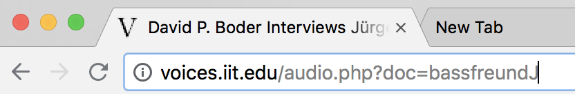

This assignment is based on the topic of a parallel lesson: From steel wire to website; the interviews of David Boder. It tells the story of the pioneering work of the Jewish Latvian-American psychologist David Boder in recording the first accounts of Holocaust survivors. In the summer of 1946 he visited several displacement camps with a wire recorder and collected 121 interviews in 8 different languages.
The focus in this lesson is on the transformation of his collection from interviews recorded on steel wires in 1946 to content that has been made accessible through a public website.

<!-- more -->

<!-- briefing-student -->

### Instructions
<!-- section-contents -->

Watch this short animation of [6 minutes 30 seconds about David Boder](../boder/#c-clip.en) and pay attention to the sequence of transformations of Boder's recordings.

<!-- section -->

### 3.a From steel wires to interactive website
<!-- section-contents -->

- What transformations and technologies are used for the audio and textual representations of Boder’s interviews?
The dates in the template can help you find the right answer.

<!-- section -->

### 3.b Restoration or replacement?
<!-- section-contents -->

- Read this short article by curator Ralph Pugh from the Illinois Institute of Technology [cit](pugh-judge-boder) about the process of publishing the collection online. What does he say about decisions that were taken with regard to the restoration of the sound?
- Listen to the first 5 minutes of [this interview with Janis B.](http://voices.iit.edu/audio.php?doc=bJanis){:target="_blank"}* in the collection of Boder.
- What would you have preferred: a better sound to help you understand what is said, or the original sound with its own atmosphere?
- Does it make sense to create access to spoken content if you don’t understand the language or could the information be limited to the translated transcript?
- Note down your answer in the template.

\* To be able to listen to [the interview](http://voices.iit.edu/audio.php?doc=bJanis){:target="_blank"}, you have to open a Chrome browser window. Click on the small “i” icon to the left of the URL and allow Flash Player and pop-ups. Bear in mind that you will hear Boder’s introduction right away but that the interview takes some time to load.

<!-- section -->

### Reading/viewing suggestions
<!-- section-contents -->

- Rosen, Alan. 2012. “'We Know Very Little in America': David Boder and Un-belated Testimony.” In *After the Holocaust: Challenging the Myth of Silence*, edited by David Cesarani and Eric J.Sundquist. New York: Routledge.

<!-- briefing-teacher -->
