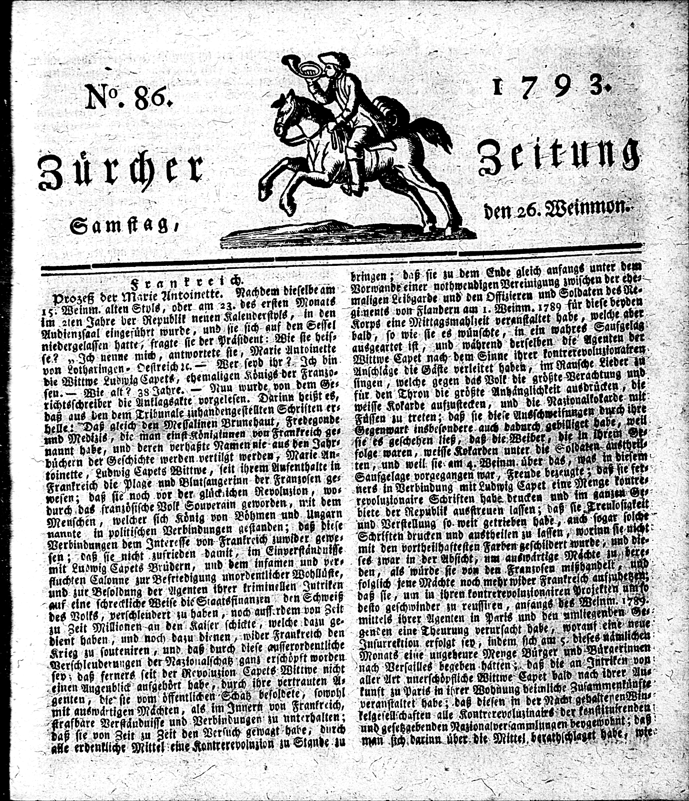
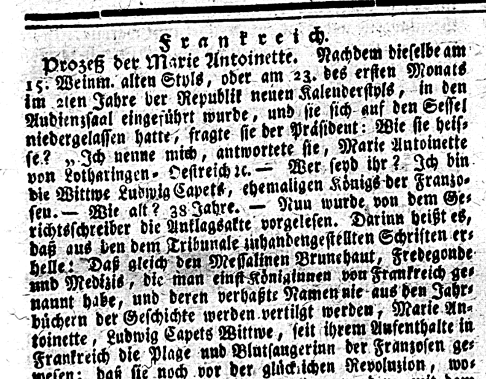

Le processus de numérisation commence par la numérisation d’un journal papier, afin de produire une image de chaque page. Étant donné qu’il est impossible d’effectuer une recherche sur une image, les lettres du texte doivent être rendues reconnaissables. Cela se fait grâce à une technique connue sous le nom de [reconnaissance optique de caractères (OCR)](https://fr.wikipedia.org/wiki/Reconnaissance_optique_de_caract%C3%A8res), à l’aide d’un logiciel capable de comprendre l’image d’un caractère et de la transformer en une unité numérique représentant un caractère unique.

Pour ce faire, deux sous-étapes doivent être réalisées&#x202F;:

1. La binarisation des couleurs de l’image, c’est-à-dire la transformation de l’image d’une page en seulement deux couleurs&#x202F;: noir et blanc. Cette étape simplifie l’image de la page et augmente le contraste entre les sections sombres et claires, ce qui permet aux caractères individuels de se démarquer de l’arrière-plan de la page.

2. La classification des lettres. Une fois que les caractères individuels ont été délimités, ils doivent être assemblés en mots. Pour ce faire, le logiciel compare d’abord les lettres capturées aux polices connues et sélectionne celle qui est la plus susceptible de convenir.

Voici des caractéristiques qu’il convient de prendre en compte&#x202F;:
- Ces lettres viennent-elles d’un alphabet latin ou arabe&#x202F;?
- Ces lettres sont-elles en _italique_ ou en __gras__&#x202F;?
- La police est-elle _Times New Roman_{:.font-times} ou _Comic Sans MS_{:.font-comic}&#x202F;?

Un mécanisme de détection similaire identifie ensuite la langue et compare les mots trouvés à un dictionnaire correspondant. Le résultat du traitement OCR est un texte transcrit lisible par une machine. Ainsi, le journal est désormais numérisé&#x202F;: nous disposons à la fois de l’image de la page et son texte.

<!-- more -->

<!-- briefing-student -->

### Instructions
<!-- section-contents -->

En 2017, Computerphile, une chaîne dont le but est d’expliquer des sujets informatiques à un public profane, a publié une interview du professeur d'informatique Steve Simske, expert en OCR, dans laquelle il explique les principes sous-jacents des logiciels OCR. Dans l’extrait suivant, il explique comment fonctionne la classification des polices&#x202F;: Nous vous invitons à regarder [ce passage de 00:10:10 à 00:12:47.](https://youtu.be/ZNrteLp_SvY?t=610){:target="_blank"}

<!-- section -->

### 1.a Reconnaissance des polices  | 20 min
<!-- section-contents -->

Le principe fondamental de la classification à considérer est le suivant&#x202F;: que faut-il pour qu’un mot soit associé à une police particulière&#x202F;? Merci de choisir deux éléments parmi les quatre ci-dessous énumérés&#x202F;:
- une bibliothèque de polices à comparer à l’image numérisée des lettres
- la meilleure moyenne des correspondances de lettres individuelles à une police particulière
- la correspondance exacte de chaque lettre à une police
- une validation manuelle de chaque mot

<!-- section -->

### 1.b OCR et police gothique
<!-- section-contents -->

Certaines polices sont plus difficiles à traiter que d’autres. La reconnaissance des textes en police gothique représente une difficulté récurrente en ce qui concerne les textes historiques. Merci de consulter [l’article «&#x202F;Vereine und Sport&#x202F;» dans le journal *Luxemburger Wort* du jeudi 16 juillet 1925, p. 4](https://viewer.eluxemburgensia.lu/ark:70795/bnfbxq/pages/4/articles/DTL105){:target="_blank"} et ensuite comparer le fac-similé au texte océrisé&#x202F;:
- que pouvez-vous dire de la variation du résultat de l’OCR pour le mot «&#x202F;chorale&#x202F;» entre la police latine et gothique dans le même texte&#x202F;?
- trouvez deux autres mots dans le texte qui commencent par un «&#x202F;C&#x202F;» majuscule en police gothique&#x202F;: en quelles lettres a-t-il été transformé&#x202F;?

<!-- section -->

### 1.c Amélioration de la qualité de l’OCR
<!-- section-contents -->

Voici l’image numérisée de la première page de la *Neue Zürcher Zeitung* (NZZ) publiée le 26 octobre 1793 à Zurich, Suisse. Elle rend compte du procès et de l’exécution de Marie-Antoinette, la veuve de Louis XVI, en octobre 1793.

The archives of the NZZ were entirely digitised for the first time in 2005, using the microfilms of newspapers to produce scans that were then OCRed. The result of this process proved to be imperfect, especially for earlier texts that were published in Gothic font.

As part of the impresso project, referred to in the clip of this lesson, Phillip Ströbel and Simon Clematide from the University of Zurich have experimented with software developed to recognise handwritten text to improve the quality of the OCR on Gothic fonts.

The two outputs of the OCR are shown below. Compare them and answer the questions.

Les archives de la NZZ ont été entièrement numérisées pour la première fois en 2005&#x202F;: d'abord, les microfilms des journaux ont été numérisés, puis traités par OCR. Le résultat de ce processus s’est avéré imparfait, en particulier pour les textes plus anciens publiés en police gothique.

Dans le cadre du projet Impresso, évoqué dans le film d'animation de cette leçon, Phillip Ströbel et Simon Clematide de l’Université de Zurich ont expérimenté un logiciel conçu pour reconnaître le texte manuscrit, afin d’améliorer la qualité de l’OCR sur les polices gothiques.

Les deux résultats de l’OCR sont présentés ci-dessous. Comparez-les et répondez aux questions posées à la fin de chaque section.

|**A. Premières lignes de l’article en première page du numéro du 26 octobre 1793 de la NZZ**|

| **B. Résultat de l’OCR en 2005** |
| Prozeß der Marie Antoinette. Nachdem dieselbe am i g. Weinm. alten StvlS, oder am rz. des ersten Monat« im 2,en Jahre der Republik neuen KaleuderstplS, in den Audienzsaal eingesührt wurde, und sie sich auf den Sessel niedergelassen hatte- fragte sie der Präsident: Wie sie heisse? „ Ich nenne mich, antwortete sie, Marie Antoinette von Lotharingen. Oestreich re. — Wer seyd ihr ?. Ich bin dir Wittwr Ludwig Capet«, ehemaligen Königs der Frauzo« seu.— Wie alt? Z8 Jahre. — Nun wurde von demGe-richtsschreiber die Auklagsakte vorgelesen. Darin» heißt e«,daß aus den dem Tribunale rnhandengestellten Schriften erhellet 'Daß gleich den Messalinen Brunehaut, Fredegoude»nd Medizi«, die man einstKöniainnea von Frankreich genannt habe, und deren verhaßte Namennie au« de» Jahrbüchern der Geschichte werden vertilgt werde» , Marie Antoinette , Ludwig Capets Wittwr, feit ihrem Aufenthalte inFrankreich die Plage und Blotfaugeriun der Franzosen gewesen; daß sie" noch vor der glücklichen Revoluzion |
| **Résultat de l’OCR amélioré en 2019** |
| Prozeß der Marie Antoinette. Nachdem dieselbe am 15. Weinm. alten Styls, oder am 23. des ersten Monats im 2ten Jahre der Republik neuen Kalenderstyls, in den Audienzsaal eingeführt wurde, und sie sich auf den Sessel niedergelassen hatte, fragte sie der Präsident: Wie sie heisse? „ Ich nenne mich, antwortete sie, Marie Antoinette von Lotharingen- Oestreich ic. — Wer seyd ihr ?. Ich bin die Wittwe Ludwig Capets, ehemaligen Königs der Franzosen.— Wie alt? 38 Jahre. — Nun wurde von dem Gerichtsschreiber die Anklagsakte vorgelesen. Darinn heißt es, daß aus en dem Tribunale zuhandengestellten Schriften erhelle: Daß gleich den Messalinen Brunehaut, Fredegonde und Medizis, die man einst Königinnen von Frankreich genaunt habe, und deren verhaßte Namen nie aus den Jahrbüchern der Geschichte werden vertilgt werden, Marie Antoinette, Ludwig Capets Wittwe, seit ihrem Aufenthalte in Frankreich die Plage und Blutsaugerinn der Franzosen gewesen; daß sie noch vor der glückichen Revoluzion |

Maintenant essayez de répondre aux deux questions suivantes&#x202F;: 
- comment le mot « Wittwe » a-t-il été reconnu en 2005 et 2019&#x202F;?
- quelles différences remarquez-vous dans la reconnaissance des chiffres entre les résultats de 2005 et de 2019&#x202F;?

À présent, examinez la transcription manuelle du même passage et comparez-la à la façon dont les chiffres ont été reconnus dans les résultats de 2005 et 2019.

| **A. Transcription manuelle** |
| Prozeß der Marie Antoinette. Nachdem dieselbe am 15. Weinm. alten Styls, oder am 23. des ersten Monats im 2tem Jahre der Republik neuen Kalenderstyls, in den Audienzsaal eingeführt wurde, und sie sich auf dem Sessel niederlassen hatte, fragte sie der Präsident: Wie sie heisse? “Ich nenne mich, antwortete Sie, Marie Antoinette von Lotharingen-Oestreich - Wer seyd ihr? Ich bin die Wittwe Ludwig Capets, ehemaligen König der Franzosen. - Wie alt? 38 Jahre. - Nun wurde von dem Gerichtsschreiber die Anklagsakte vorgelesen. Darinn heißt es daß aus den dem Tribunale zuhandengestellten Schriften erhelle: Daß gleich den Messalinen Brunehaus, Fredegonde und Medizis, die man einst Königin von Frankreich genannt habe, und deren verhaßte Namen nie aus den Jahrbüchern der Geschichte werden vertilgt werden, Marie Antoinette, Ludwig Capets Wittwe, seit ihrem Aufenthalte in Frankreich die Plage und Blutsaugerinn der Franzosen gewesen: daß sie noch der glücklichen Revoluzion, |

Auriez-vous pu trouver cet article-ci sur la base du premier résultat OCR, si vous aviez effectué une recherche avec les mots-clés «&#x202F;Marie Antoinette&#x202F;» «&#x202F;Revolution&#x202F;»&#x202F;? Merci d'expliquer, pour chaque cas, pourquoi cela aurait été possible ou pas.   

<!-- section -->

### Suggestions de lectures/vidéos
<!-- section-contents -->

*Pour un aperçu technique et historique, ainsi que des informations à propos de certaines applications de la reconnaissance optique de caractères (OCR) consulter&#x202F;:*
- Wikipédia. «&#x202F;Reconnaissance optique de caractères&#x202F;». Dernière modification le 30 novembre 2022. [Wikipedia article](https://fr.wikipedia.org/wiki/Reconnaissance_optique_de_caract%C3%A8res){:target="_blank"}

*Pour comprendre comment la reconnaissance optique de caractères (OCR) identifie les caractères et les mots (la reconnaissance de formes), regarder&#x202F;:*
- Sharda, Aryaman. «&#x202F;How Does Optical Character Recognition (OCR) Work&#x202F;». 21 novembre 2017. Vidéo éducative, 00:01:30. [Vidéo YouTube](https://www.youtube.com/watch?v=cAkklvGE5io){:target="_blank"}

*Pour une explication plus détaillée de chaque étape du processus de reconnaissance optique de caractères (OCR), regarder l’interview du professeur Steve Simske&#x202F;:*
- Riley, Sean.  «&#x202F;Optical Character Recognition (OCR)&#x202F;». July 4, 2017. *Computerphile*. Vidéo éducative, 00:14:15. [Vidéo YouTube](https://www.youtube.com/watch?v=ZNrteLp_SvY){:target="_blank"}

*Informations sur le principe de binarisation à partir de 00:02:29&#x202F;:*
- Riley, Sean. «&#x202F;Optical Character Recognition (OCR)&#x202F;». 4 juillet 2017. *Computerphile*. Vidéo éducative, 00:14:15. [Vidéo YouTube](https://youtu.be/ZNrteLp_SvY?t=149){:target="_blank"}

*Informations sur le composant connecté unique (ou lettre unique) à partir de 00:03:55&#x202F;:*
- Riley, Sean.  «&#x202F;Optical Character Recognition (OCR)&#x202F;». 4 juillet 2017. *Computerphile*. Vidéo éducative, 00:14:15.[Vidéo YouTube](https://youtu.be/ZNrteLp_SvY?t=235){:target="_blank"}

*Informations sur la reconnaissance des types de lettres utilisés dans un texte donné ou la classification des polices à partir de 00:07:27&#x202F;:* 
- Riley, Sean. «&#x202F;Optical Character Recognition (OCR)&#x202F;». 4 juillet 2017. *Computerphile*. Vidéo éducative, 00:14:15. [Vidéo YouTube](https://youtu.be/ZNrteLp_SvY?t=446){:target="_blank"}

<!-- briefing-teacher -->
