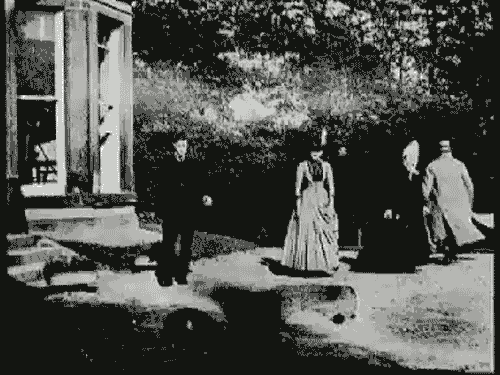
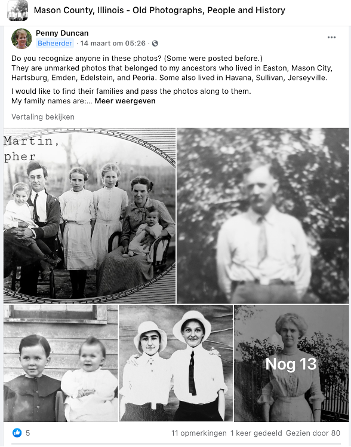
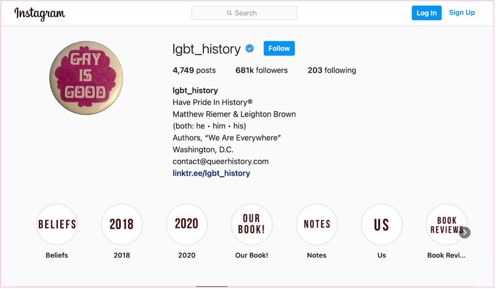
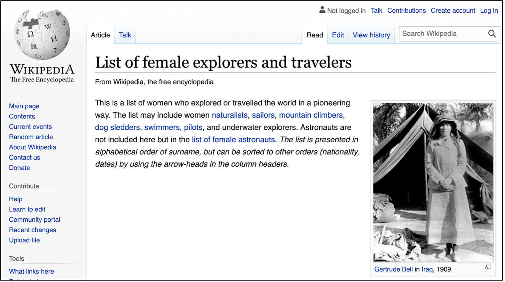

Amongst historians, it is argued that in order to consider an event "mature" enough for historical inquiry, there should be distance in time and access to classified documents. This idea of a necessary "waiting period" has long  determined the "historicity" of a given event or topic. The advent of the web and social media—with direct access to an abundance of data, especially in the realm of private life—seems to have challenged the idea of what can be considered as "historical". In this assignment, you are going to be confronted with different opinions on the role of social media in history and whether they can be considered "historical sources".

{:.mosaic}
{:target="_blank"}
{:target="_blank"}
{:target="_blank"}

Image credits:
[Linaria Comunicación via Giphy](https://media.giphy.com/media/rB8CbdO6xSJofmOAKL/giphy.gif),
[INTO ACTION via Giphy](https://media.giphy.com/media/gIMdqhwG5Xa45Mb2Ex/giphy.gif),
[Flamingo Services via Giphy](https://media.giphy.com/media/jQmn1Dkw55R3cjm3eC/giphy.gif)

<!-- more -->

<!-- briefing-student -->

### 1.a What can be considered "historically relevant" social media expressions?  | 20 Min
<!-- section-contents -->

Do you consider any of these messages, posts, photos, or web pages "historical"? Argue why or why not you would consider this content "historical" and support your answers through web research on the background and/or authors of the content. Write down your answers in the answer form.

[A Tweet](https://www.bbc.com/news/technology-13257940)

{:.mt-5}
[A Gif](https://media.giphy.com/media/LMeVjYYdUkOoE/giphy.gif)

{:.mt-5}
[A Facebook group](https://www.facebook.com/groups/1500687070143366)

{:.mt-5}
[An Instagram account](https://www.instagram.com/lgbt_history/)

{:.mt-5}
[A Wikipedia page](https://en.wikipedia.org/wiki/List_of_female_explorers_and_travelers)

{:.mt-5}

<!-- section -->

### 1.b Arguments put forward by historians | 30 Min
<!-- section-contents -->
After having argued why or why not something should be considered "historical", let's examine what professional historians have to say on the subject.

**Option 1**

Read the following two blogs by professional historians and jot down what arguments are presented by the authors about *what can be considered to be part of the "past"*:

1. [Suzannah Lipscomb in the British history journal *Historytoday* in her blog post "How recent is History?"](https://www.historytoday.com/how-recent-history) (770 words).
Selected quote: "Historians from the page might want to learn from those of the screen".

2. [Historian Ian Milligan in the British/Australian platform for journalism The Conversation](https://theconversation.com/historians-archival-research-looks-quite-different-in-the-digital-age-121096) (1,100 words).
Selected quote: "Today, hundreds of billions of websites preserved at the Internet Archive alone is more archival information than scholars have ever had access to".

**Option 2**

Watch the two clips and read the two blogs below and then list some *positive and problematic aspects of historians engaging with social media.*

Clips:

1. [Journalist/writer John Birmingham on the website of the Born Digital program of the National and State Libraries of Australia](https://youtu.be/p9BmO-HLcVk) (9 min).
Selected quote: "All of that stuff, of which we don’t really think about, because it’s like the air around us, that’s HISTORY!"

2. [Historian Rebecca Huntley on the website of the Born Digital program of the National and State Libraries of Australia](https://www.youtube.com/watch?v=hR9VQPfNHaE&feature=youtu.be) (3.30 min).
Selected quote: "Reflecting now on my life, and the documents in my life, a lot is not written down".

Blogs:

1. [Historian Cathrine Fletcher in the British journal *History Today*](https://www.historytoday.com/archive/head-head/social-media-good-history) (1,480 words).
Selected quote: "In a Twitter thread last June, curator Sara Huws wrote of her concern that the histories she tweeted from a Welsh museum account got more attention if she implied they’d been suppressed".

2. [Digital historians Caroline Mueller and Frederic Clavert reflect on the prejudices of historians against social media](https://www.historytoday.com/archive/head-head/social-media-good-history) (4,237 words).
Selected quote: ‘"The social networking service Twitter suffers from a bad reputation in the academic world and, more broadly, among those who do not use it".

Combining your own thoughts with those you have now seen from professional historians, write a short essay of about 500 words with your opinion on when an event, experience, or artifact becomes "historical" and what this means for the relationship between historians and social media. Use the space in your answer form.
(Hint: Think of the introduction of previous popular media such as radio, the telephone, film, or television and what kind of sources they yielded)

<!-- section -->

### Reading/viewing suggestions
<!-- section-contents -->
["How does the past become history?" History on screen, University of Tartu](https://ajalugu.haridusekraanil.ee/en/theoretical/time-together/how-does-the-past-form-the-history). Last accessed 28 April 2021.

<!-- briefing-teacher -->
