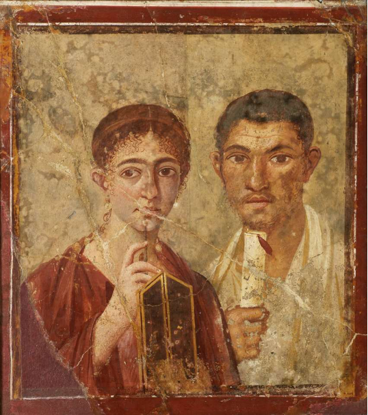

When looking at social media from a historian's perspective, it is important to remember that opinions differ between experts on how to even define "social media" as well as  whether or not this form of communication existed in the pre-internet era. Much of these debates hinge on whether the technical infrastructure as such is the innovative element, or what people do with the technical infrastructure when it becomes available. From the perspective of a historian, the term "social media" is problematic, as media have a social function by definition. Even within the scope of the digital era, the term ‘social’ poses problems, as it can confusingly also refer to the pioneering sharing platforms that evolved in the early 2000s, such as MySpace and Friendster. At the time, they were coined Social Networking Sites. With the introduction of Twitter, Pinterest, Instagram and Snapchat, arguably geared towards sharing content more than creating networks, the broader term "social media" gained traction. In this assignment, you are going to explore the historical continuities and discontinuities of the phenomenon of social media. 

<!-- more -->
<!-- briefing-student -->

### 2.a When did it all start?| 20 Min
<!-- section-contents -->

Image credit: Portrait of Terentius Neo, ca. 20-30 CE. Currently preserved at the Naples National Archaeological Museum and freely available in the public domain. Available at: https://www.museoarcheologiconapoli.it/en/room-and-sections-of-the-exhibition/frescoes/

Watch this TEDx Talk by [journalist and computer scientist Tom Standage author of "Writing on the wall"](https://youtu.be/ixsridS3qVs)(16 min), a study on social media from a historical perspective. In his talk, he argues that a number of historical periods and events have the same type of communication structure as present-day social media. He goes so far as to regard the era of traditional analogue media - radio, television, and film - as an exception to the practice of passing on information at a low cost that can be modified from one peer to another. In his view, the twenty-first century is a "return" to the communication structures that were common before the technological innovations of the nineteenth and twentieth centuries.
In the table below, the key characteristics of this YouTube clip are listed. Your task is to check Standage’s claims about social media being the continuation of an old practice by complementing the table with the examples that he gives of social media in the past. Try to determine whether the features of the ancient social media that Standage discusses are similar or different to contemporary ones.

| | Content | Time period and geographic area | Social Medium | Technologies applied |
| Wax tablets and scrolls	|  |  |  |  |
| Pamphlets |  |  |  |  |
| Coffeehouses |  |  |  |  |
| Radio broadcasts |  |  |  |  |
| Film recording of a lecture with slides by a renowned scholar on the topic of technology and communication (16 min)  |  |  |  |  |

*This is a simplification of the technological processes involved in uploading and viewing a YouTube video. For more detailed information on these processes, check out [this 2016 infographic from How It Works](https://www.howitworksdaily.com/wp-content/uploads/2016/04/How-YouTube-works-1024x891.jpg).

<!-- section -->

### 2.b Different views on the beginning of social media | ? Min
<!-- section-contents -->

Read this concise history on the origins of social media,offered as part of an [online course for bachelor students of marketing at Maryville University in St. Louis, Missouri (USA)](https://online.maryville.edu/blog/evolution-social-media/) , and answer the following question in your answer form. 

[card]evolution-social-media

- What was the first form of social media, according to the definition of social media referred to in this article?
- According to the author, there have been two major shifts with regard to users/audiences who engage with social media and the devices through which they communicate. Identify these two changes.

[card]history-cooperative                         | 

Now read a different version of the history of social media, this time published on the platform [History Cooperative by author Matthew Jones](https://historycooperative.org/the-history-of-social-media/) and answer the following question in your answer form. 

"The Complete History of Social Media: A Timeline of the Invention of Online Networking", History Cooperative, June 16, 2015, https://historycooperative.org/the-history-of-social-media/. Last accessed 6 October 2020.

Which two key elements are different in Jones' interpretation of the phenomenon of social media compared to the one offered by Maryville University?

                         |

<!-- briefing-teacher -->
