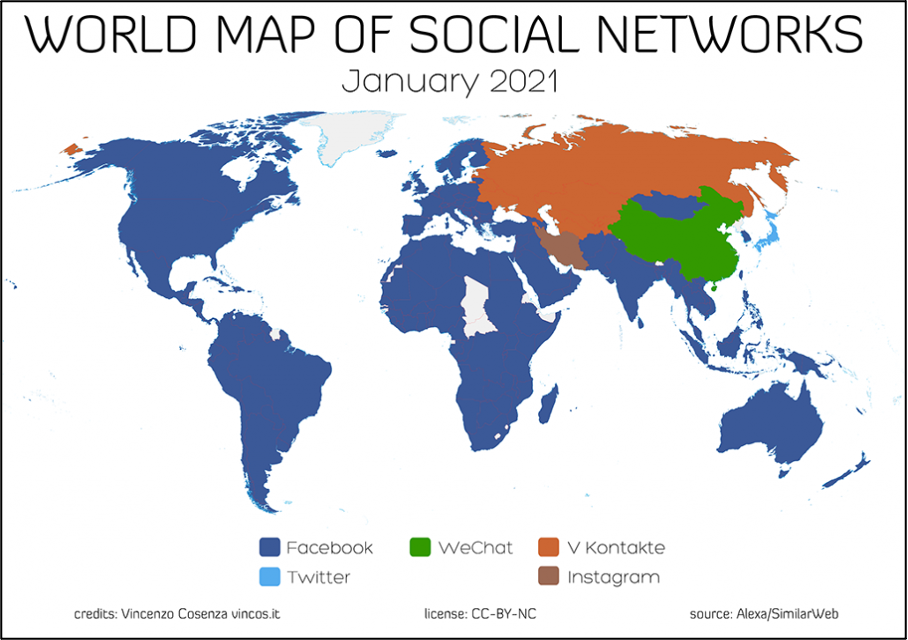

"2021 World Map of Social Networks". Image created by Vincenzo Cosenza and used here without adaptation from the original on [Vinco’s Blog](https://vincos.it/world-map-of-social-networks/) under Creative Commons License [CC-BY-NC](https://creativecommons.org/licenses/by-nc/2.0/).

In this assignment, you are expected to conduct web research to establish the profiles of different social media platforms. There are many approaches to specifying the characteristics of a social medium; for instance, one can consider the technology and the type of communication it facilitates, the user experience, or focus on the policy and strategy of the company that runs the social medium, that is, the business model. These different approaches help to better understand what these different social media actually are. In classifying their typology, historians can more accurately analyse their content as digital sources.

<!-- more -->
<!-- briefing-student -->

### 3.a Social media around the world | 20 Min

<!-- section-contents -->

We list below a number of social media platforms and we propose you conduct web research to gather information about some of their caracteristics. The aim of the assignment is to make you familiar with the various ways these platforms function. Some of them are popular worldwide, while others are known primarily in specific regions of the world - you might even catch several that are no longer active but this is also interesting to consider! The list we propose is not exhaustive and it is of course possible to include more platforms, following your interests; or you can even select a limited number from the list, we suggest however that you focus your work on no less than three platforms. You can also adjust the selected caracteristics to your own research interests. Do not be intimidated if during your research you need to make use of translation tools for languages that you don’t completely understand.

| Service |
|:--------:|
| Facebook	|
| VKontakte |
| Cloob |
| JamiiForums | 
| Ravelry | 
| Instagram |
| TikTok |

Try now to establish the profile of the services you selected according to the caracteristics we propose below. Please note that several options are possible for each caracteristic - for example, once you consider the device, most services are accessible from various types.  

- *Type of platform*: Is it primarily used for blogging, discussing, sharing, connecting, crowdsourcing, etc.?
- *Content type*: What kind of content - news, opinions, photos, personal stories, messages, games, films, clips, hobbies, etc. - is produced on this platform?
- *Closest similar set of practices in the analogue era*: e.g., pub, letter, telegraph, cinema, photo album, etc.
- *Target audience*: Who is the primary target of this platform? Business, leisure, other?
- *Device*: What kind of device - computer, tablet, smartphone, etc. - do you need to access the social medium?
- *Content moderation*: Is what is posted by users monitored? If so, by whom and for what reason? If not, why not?
- *Data privacy*: What is the policy of the company that runs the platform about the users data? What happens to this data?
- *Geographic basis*: In what country is based the enterprise that runs the service?   
- *Areas served*: Is the service available worldwide?   
- *Predominant geographic/cultural zones*: Are there specific geographic and/or linguistic zones where the use of service is more popular?  

<!-- section -->

### 3.b The companies behind social media | 25 Min
<!-- section-contents -->

Now you are going to focus on the companies behind a number of well-known social media platforms and the  strategies and policies of these companies regarding their platforms. We propose a list of three companies below but you can continue working on the ones you already selected in the previous sub-assignment - in the latter case, you might already have obtained information on some of the points we propose you examine below. 

| Service |  
|:--------:|
| LinkedIn |
| WhatsApp |
| YouTube |

- *Type of platform*: Blogging / discussing / sharing / connecting / crowdsourcing, etc.?
- *Creators*: Founder, founding date, name of company, Chief Executive Officer, location of headquarters.
- *Business model*: How do they generate income?
- *Selling point*: What makes them unique and attractive to use?
- *Content moderation*: Is what is posted by users monitored? If so, by whom and for what reason? If not, why not?
- *Data privacy*: What is the policy of the company that runs the platform about the users data? What happens to this data?

<!-- section -->

### 3.c Business models of social media | 25 Min
<!-- section-contents -->

After having compared the different companies behind some of the world's most well-known social media platforms, read this infographic post  ["How Social Sites Make Money"](https://www.getcenturylink.com/how-social-sites-make-money) from *CenturyLink* as well as this 2018 article by Will Oremus in *Slate* ["Are You Really the Product?"](https://slate.com/technology/2018/04/are-you-really-facebooks-product-the-history-of-a-dangerous-idea.html). After reading both articles, answer the following questions below in a short answer of approximately 500 words:
- What is the connection between personal data and income generation for social media platforms?
- What do you think about the ethics behind this connection?

<!-- briefing-teacher -->
