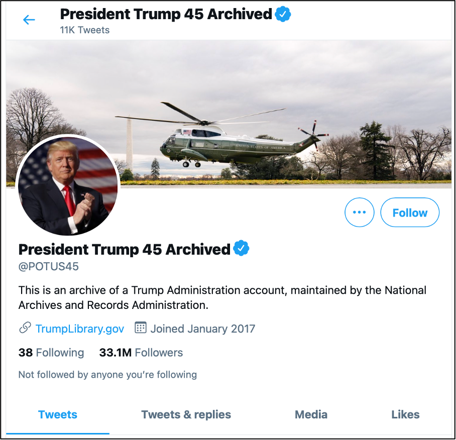

"Digital Preservation." Image created by Jørgen Stamp and used here without adaptation from [the original on Digitalbevaring.dk](https://digitalbevaring.dk/illustration/)
under Creative Commons License [CC BY 2.5 DK](https://creativecommons.org/licenses/by/2.5/dk/deed.en_GB).

<!-- more -->
<!-- briefing-student -->

### 5.a An historical inquiry into two archived social media platforms | 25 Min
<!-- section-contents -->

{:.text-center}
{:style="width:250px;display:inline"}
{:style="width:250px;display:inline"}

SixDegrees: Current logo available in public domain. Image from [Wikimedia Commons](https://commons.wikimedia.org/wiki/File:SixDegrees.com_logo.png).
Friendster: Former logo used from 2002-2009. Image from [1000 Logos](https://1000logos.net/wp-content/uploads/2021/04/Friendster-Logo-2002.png).

In the chronological list of social media referred to in assignment 3.b two early initiatives are mentioned: SixDegrees.com (<http://sixdegrees.com>) and Friendster (<http://www.friendster.com>, now defunct). If these would be the names of telephone companies or daily newspapers from the early 1900s, you would probably start your research in company or government archives. But who is responsible for preserving the content of web platforms that were accessible worldwide but no longer exist? We are lucky to have the non profit organisation, the Internet Archive, dedicated to instructing robots to make daily snapshots of whatever is published online, store this material in a database and make it retrievable through a search interface.
You are now going to conduct an historical inquiry into these two social media platforms by consulting the Internet Archive.
[For a more in-depth explination, see our handout on how to search the Internet Archive (IA)](https://ranke2.uni.lu/assets/pdf/wayback-machine-interface.pdf).

- Put the url "<http://sixdegrees.com>" in the search box of the IA and search for snapshots made on 29 April 1999, such as [this one](https://web.archive.org/web/19990428073521/http://www.sixdegrees.com/).

- Open up a new tab in your browser and now search for "<http://www.friendster.com>" and look for the snapshots made on 1 April 2004, such as [this one](https://web.archive.org/web/20040401183007/http://friendster.com/info/moreinfo.jsp).

- You now have 2 start pages with several links to other pages. Compare the two by reading the homepage, checking the links that still work, and looking up information in the sections "about us", "about the company", and/or "about the site". These sections are often found in a small font at the very bottom of a page. 

- Complete the following table on the basis of the information you can find:

| | SixDegrees | Friendster |
| Created: date, place, name of authors/company |  |  |
| Business model: |  |  |
| Objective: |  |  |
| Target audience: |  |  |
| Access: |  |  |
| Design: |  |  |
| Users: How many, their background, nationality |  |  |
| Shut down or bought by other company:
who when and why |  |  |

<!-- section -->

### 5.b Archival efforts to preserve social media | 20 Min
  <!-- section-contents -->

The duty of a person or group to deposit a copy of a publication or of a government to deposit all its documents in a national library or archive is often called a "[legal deposit](https://www.ifla.org/book/export/html/8302)", although the exact term varies from country to country. Until the late twentieth century, this obligation only applied to printed materials, only rarely considering audio-visual materials. With the advent of digital technology, most legislation was extended to digital documents. While this is fairly feasible with regard to static digital content, with the increasingly dynamic, interactive, and immediate character of social media data (not to mention  the issue of copyright), cultural heritage institutions are faced with a new set of challenges.

Read the following two blogs and make notes on arguments for the preservation of Tweets and those against:
- The Library of Congress announced on its website that it is going to preserve all tweets that have been created through Twitter, on 14 April 2010. Read the blog post and then go through the first 30 comments on the announcement. "How Tweet It Is!: Library Acquires Entire Twitter Archive" by Matt Raymond, Library of Congress Blog, 14.04.2010, <https://blogs.loc.gov/loc/2010/04/how-tweet-it-is-library-acquires-entire-twitter-archive>

- Blog published seven years later. "Update on the Twitter Archive at the Library of Congress" by Gayle Osterberg, Library of
Congress Blog, 26.12.2017, <https://blogs.loc.gov/loc/2017/12/update-on-the-twitter-archive-at-the-library-of-congress-2>

{:.w-100}
{:.text-center}
| Pro-preservation |  Against preservation |
|   |   |
|   |   |
|   |   |

<!-- section -->

### 5.c Who is still covered by the Library of Congress? | ? Min
 <!-- section-contents -->

- Read this article by Andrew McGill on how the Library of Congress (LOC) underestimated the problems that it would encounter by archiving every single Tweet ever published: , "Can Twitter Fit Inside the Library of Congress?" by Andrew McGill, *The Atlantic*, 04.08.2016, <http://www.theatlantic.com/technology/archive/2016/08/can-twitter-fit-inside-the-library-of-congress/494339/>.

- Next, have a closer look at the Twitter account [@POTUS45](https://twitter.com/POTUS45).

{:style="max-height:500px"}

Screenshot of ["President Trump 45 Archived (@POTUS45)" Twitter page](https://twitter.com/POTUS45) taken on a desktop computer on 14 April 2021.

- Answer the following questions in a short response of approximately 250 words. 
1. Has the Library of Congress indeed applied the criteria that they describe in their change of policy in December 2017?
2. Does this mean that these archived Tweets are accessible for research? Elaborate your answer with arguments.

{:.w-100}
{:style="height:100px"}
| |

<!-- section -->

### 5.d What about other social media?  | 20 Min
 <!-- section-contents -->

Much attention has been given to the "open approach" of Twitter with regard to access to its data. But what about the many other social platforms? Do they offer the same possibilities?
Read [this paper by Helen Hockx-Yu about the difficulties of archiving social media data for cultural heritage institutions](http://library.ifla.org/999/1/107-hockxyu-en.pdf), presented at the international conference of the Federation of Libraries and Archives in 2014 in Lyon.

List three important arguments for why archiving social media is problematic:

{:.w-100}
| 1. |
| 2. |
| 3. |

At the end of her paper, she suggests alternative ways of preserving social media through key institutions that are held accountable. Imagine your daily use of social media and the needs of a historian 100 years from now to understand the lifestyle of young people between 2020 and 2025 (the years of Covid and its aftermath).
  - What do you think should be preserved?
  - In which way and by what means?
  - What would motivate you to make this effort of preserving your private archive?
  - What are your ideas about who owns the copyright to your work and how your privacy and that of your social circle should be dealt with?

{:.w-100}
| 1. |
| 2. |
| 3. |
| 4. |

<!-- briefing-teacher -->
