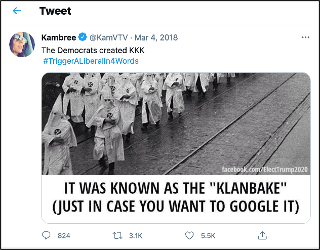
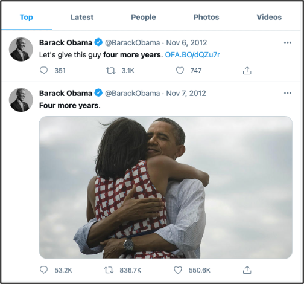
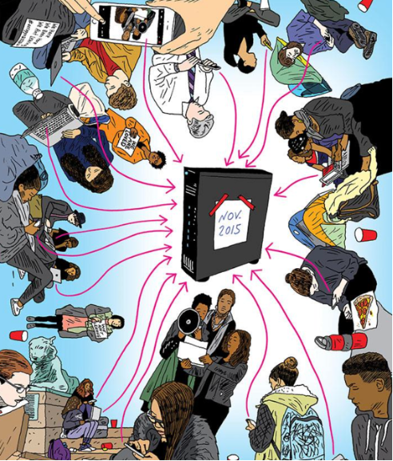
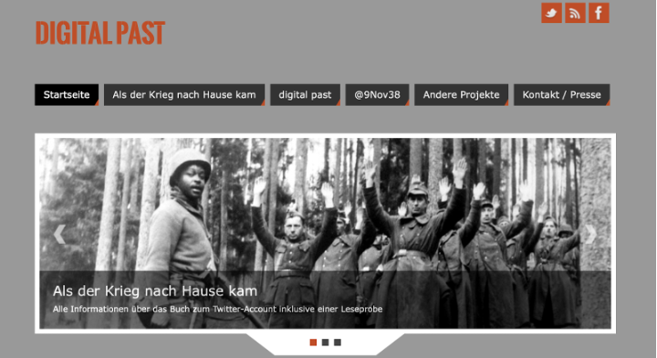

In this assignment, a series of examples are presented in which social media have been used in various ways, including:
1.  To illustrate the changes in the practice of historians
2.  To teach history in a new way
3.  To spread fake history
4.  To document a historical event

For each example below, note what arguments are put forward by the corresponding article and then write a short text (150 words max.) about how the example applies to one or more of the four cases described above.

<!-- more -->
<!-- briefing-student -->

### 6.a Ku Klux Klan Tweet | 20 Min
<!-- section-contents -->

Image credit: [Kambree (@KamVTV) on Twitter](https://twitter.com/KamVTV/status/970134790098714625)

Article: "How social media spread a historical lie" by Jennifer Mendelsohn and Peter A. Shulman, 15 March 2018, _The Washington Post_. Available at: [https://web.archive.org/web/20180315150517/https://www.washingtonpost.com/news/made-by-history/wp/2018/03/15/how-social-media-spread-a-historical-lie/](https://web.archive.org/web/20180315150517/https://www.washingtonpost.com/news/made-by-history/wp/2018/03/15/how-social-media-spread-a-historical-lie/). Last accessed 27 August 2021.

Please summarize the main arguments put forward in the article (no more than three). 

Then try to explain how this example applies to one ore more ways in which social media are used as outlined in the introduction. You can do this by writing a short text (150 words max.) or by recording yourself or by exchanging with your classmates/colleagues. 

<!-- section -->

### 6.b Election Tweet | 25 Min
  <!-- section-contents -->

Image credit: [Barack Obama (@BarackObama) on Twitter](https://twitter.com/BarackObama/status/266031293945503744)

Article: "Historical Understanding in the Quantum Age" by Joshua Sternfeld, published 20 January 2014 and revised August 2014, _Journal of Digital Humanities_. Available at: <http://journalofdigitalhumanities.org/3-2/historical-understanding-in-the-quantum-age>. Last accessed 27 August 2021.

Please summarize the main arguments put forward in the article (no more than three). 

Then try to explain how this example applies to one ore more ways in which social media are used as outlined in the introduction. You can do this by writing a short text (150 words max.) or by recording yourself or by exchanging with your classmates/colleagues. 

<!-- section -->

### 6.c Collecting as much as possible | 15 Min
 <!-- section-contents -->

 

Image credit: Peter Arkle for the cover image of the 6 June 2018 article "Born Digital: How Social Media and Paperless Offices are Reshaping the University Archives" from the _Princeton Alumni Weekly_.

Article: "Born Digital: How Social Media and Paperless Offices are Reshaping the University Archives" by Brett Tomlinson, 6 June 2018, _Princeton Alumni Weekly_. Available at: <https://paw.princeton.edu/article/born-digital-how-social-media-and-paperless-offices-are-reshaping-university-archives>. Last accessed 27 August 2021.

Please summarize the main arguments put forward in the article (no more than three). 

Then try to explain how this example applies to one ore more ways in which social media are used as outlined in the introduction. You can do this by writing a short text (150 words max.) or by recording yourself or by exchanging with your classmates/colleagues. 

<!-- section -->

### 6.d Each day of the last month of the Second World War | 15 Min
 <!-- section-contents -->

 

Image credit: Screenshot of the ["digitalpast" project homepage](https://digitalpast.de/) taken on a desktop computer on 14 April 2021.

Web page: About page of the "digitalpast" project. Available at: <https://digitalpast.de/als-der-krieg-nach-hause-kam/digitalpast-english>. Last accessed 27 August 2021.

Please summarize the main arguments put forward in the article (no more than three). 

Then try to explain how this example applies to one ore more ways in which social media are used as outlined in the introduction. You can do this by writing a short text (150 words max.) or by recording yourself or by exchanging with your classmates/colleagues. 

<!-- briefing-teacher -->
