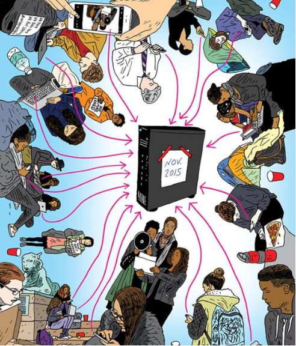
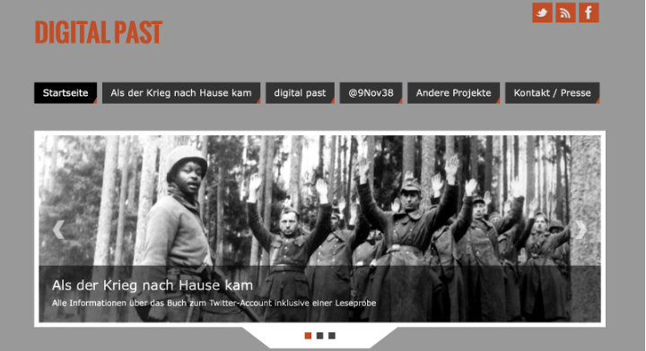

In this assignment, a series of examples is presented in which a social medium has been used to:
1.  Illustrate the changes in the practice of historians,
2.  Teach history in a new way,
3.  Spread fake history, 
4.  Document a historical event 

For each example below, write a short text (150 words max.) about how it applies to one or more of the four cases above as well as what arguments are put forward by the corresponding article.

<!-- more -->
<!-- briefing-student -->

### 6.a Tweet - Ku Klux Klan 
<!-- section-contents -->]

Image credit: Kambree (@KamVTV) - https://twitter.com/KamVTV/status/970134790098714625 
Article: "How social media spread a historical lie" by Jennifer Mendelsohn and Peter A. Shulman, 15 March 2018, The Washington Post. Available at: https://www.washingtonpost.com/news/made-by-history/wp/2018/03/15/how-social-media-spread-a-historical-lie/. Last accessed 10 May 2021.

Arguments that are made:

{:.w-100}
| 1. |
| 2. |
| 3. |

<!-- section -->

### 6.b Tweet elections
  <!-- section-contents -->

Image credit: Barack Obama (@BarackObama) - https://twitter.com/BarackObama/status/266031293945503744 
Article: "Historical Understanding in the Quantum Age" by Joshua Sternfeld, published 20 January 2014 and revised August 2014, Journal of Digital Humanities. Available at: http://journalofdigitalhumanities.org/3-2/historical-understanding-in-the-quantum-age/. Last accessed 10 May 2021.

Arguments that are made:

{:.w-100}
| 1. |
| 2. |
| 3. |

<!-- section -->

### 6.c Collecting as much as possible 
 <!-- section-contents -->
 
 
 
 
Image credit: Peter Arkle for the 6 June 2018 article "Born Digital: How Social Media and Paperless Offices are Reshaping the University Archives" from the Princeton Alumni Weekly.
Article: "Born Digital: How Social Media and Paperless Offices are Reshaping the University Archives" by Brett Tomlinson, 6 June 2018, Princeton Alumni Weekly. Available at: https://paw.princeton.edu/article/born-digital-how-social-media-and-paperless-offices-are-reshaping-university-archives. Last accessed 10 May 2021.

Arguments that are made:

{:.w-100}
| 1. |
| 2. |
| 3. |

<!-- section -->

### 6.d Tweet - Each day of the last month of the Second World War. 
 <!-- section-contents -->

 

Image credit: Screenshot of the "digitalpast" project homepage taken on a desktop computer on 14 April 2021 - https://digitalpast.de/ 
Web page: About page of the "digitalpast" project. Available at: https://digitalpast.de/als-der-krieg-nach-hause-kam/digitalpast-english/. Last accessed 10 May 2021.

Arguments that are made:

{:.w-100}
| 1. |
| 2. |
| 3. |

<!-- briefing-teacher -->

