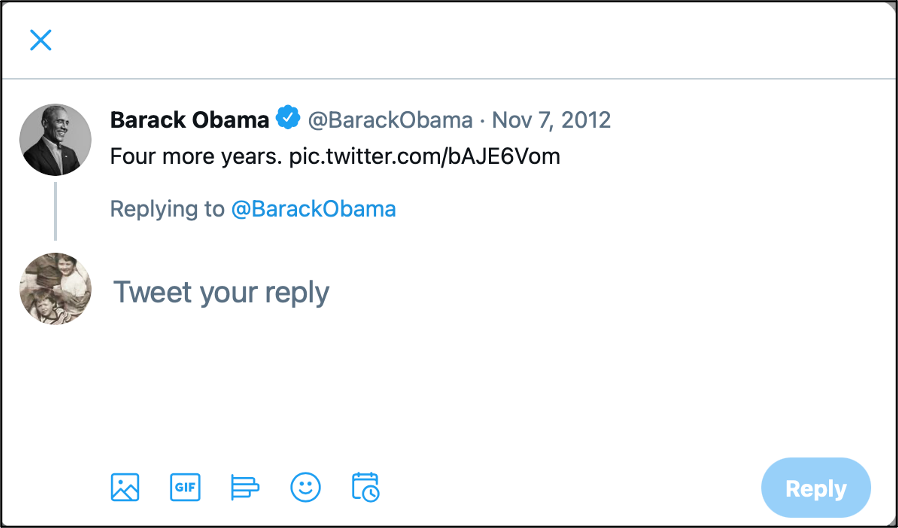
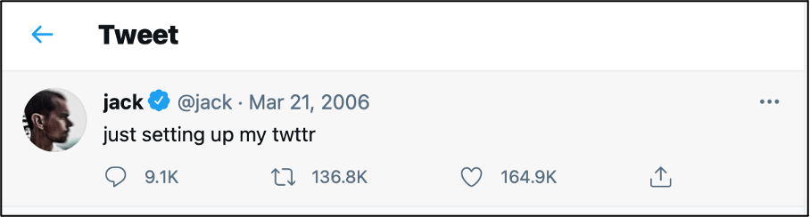

Twitter, now known as X, was launched in March 2006. It has grown to have between 300 and 400 millions users, according to various estimates and “official” figures published by Twitter Inc. Twitter became known for its ability to circulate information very quickly and provoke major controversies (including instances of harassment), for its role in socio-political movements (such as #BlackLivesMatter or #MeToo) and focus on current affairs, and for the strong presence of journalists on the platform.

In 2022, following the conclusion of a legal agreement with the shareholders of Twitter Inc. on 14 April and a number of twists and turns, Elon Musk bought Twitter with effect from 27 October 2022. Since then, Twitter has been restructured, with many staff being laid off, and renamed X. Many measures taken since October 2022 have been contested, including the reinstatement of accounts expressing far-right views and the partial switch to a pay model for users. These decisions led to the loss of many advertisers and called into question the long-term future of the platform.

<html>

This lesson, initially published in 2021, was modified at the end of 2023 to take into account the transition of Twitter to X, while retaining a strong historical focus. The aim is not to study the platform as it is today, but rather how it has evolved since 2006.

</html>

In this assignment, the various features/dimensions of the social media platform Twitter are discussed: its history, including its transformation into X, how it is used, how it can be analysed, and how it is preserved and archived.

<!-- more -->
<!-- briefing-student -->

### 7.a How Twitter was created | 15 Min
 <!-- section-contents -->

{:style="max-height:500px"}

Image credit: An early sketch of the ideas that would become Twitter. Published on [Jack Dorsey's Flickr account on 24 March 2006](https://flickr.com/photos/jackdorsey/182613360/).

Read this [interview in the _Los Angeles Times_ with Jack Dorsey](https://latimesblogs.latimes.com/technology/2009/02/twitter-creator.html), one of the founders of Twitter, from 18 February 2009.
- What was the inspiration for Dorsey to create Twitter?
- How did he design a prototype for the application?
- Which feature of instant messaging was emulated for Twitter?

<!-- section -->

### 7.b How Twitter was defined | 10 Min
 <!-- section-contents -->

Image credit: [The Lighthouse(@the_bercibot)](https://twitter.com/the_bercibot/status/1379647473640161280)

Go to the archived version of [Twitter beginner’s guide](https://web.archive.org/web/20180103203839/https://help.twitter.com/en/new-user-faq) and answer the following questions:
- What is a tweet?
- What is the length (the number of characters) of a tweet at present?
- Has it always been this length?
- Why is the number of characters of a tweet limited?
- How does the limitation of characters relate to the specificity of Twitter?

<!-- section -->

### 7.c How Twitter changed over time | 25 Min
 <!-- section-contents -->

Image credit: Current Twitter logo respecting the Brand Guidelines. Taken from the [Twitter Brand Toolkit](https://about.twitter.com/en/who-we-are/brand-toolkit).

In this section, we use both the live web and the Internet Archive’s Wayback Machine. For guidelines on how to use the latter resource see this [teaching aid for the Wayback Machine](https://ranke2.uni.lu/assets/pdf/wayback-machine-interface.pdf). Those who already have an X account will first need to log out from their account to be able to complete this assignment.

Use the historic URL of the Twitter homepage in your navigator: `http://www.twitter.com`

- Does the page you reach still display elements of the “Twitter” brand?
- Based on the [Wikipedia article about Twitter’s evolution](https://en.wikipedia.org/wiki/Twitter#2022–present), can you explain why?
- Go back to the page you reached when using the URL `https://www.twitter.com/`. What does the text say on the homepage? (If you have a user account, you will need to be logged out.)

Now go to `https://x.com/`. What happens? What does the page say about the brand switch from Twitter to X?

Open the following three hyperlinks to the Internet Archive. Each one of them provides an archived version of the Twitter homepage in different moments in 2006, 2009 and 2015. Then, copy the texts that are displayed on the homepage of Twitter and note some of the changes over the different years, if any.

- [https://web.archive.org/web/20060930214639/https://twitter.com/](https://web.archive.org/web/20060930214639/https://twitter.com/)
- [https://web.archive.org/web/20090413225407/http://twitter.com/](https://web.archive.org/web/20060930214639/https://twitter.com/)
- [https://web.archive.org/web/20150319071319/https://twitter.com/](https://web.archive.org/web/20060930214639/https://twitter.com/)

<!-- section -->

### 7.d How you can interact with others on Twitter/X | 10 Min
 <!-- section-contents -->

Image credit: Screenshot of selecting "reply" to an already posted Tweet taken on a desktop computer on 14 April 2021.

Go to this [New York Times article by Mike Isaac](https://www.nytimes.com/2017/09/26/technology/twitter-280-characters.html?smid=url-share). After reading it, try to answer the following questions:
- In what ways can you respond to a tweet?
- Can you “like” a tweet/post? Why would you?
- Can you mention a user in a tweet? Why?

<!-- section -->

### 7.e How a tweet is archived | 15 Min
 <!-- section-contents -->

Image credit: [Jack Dorsey (@jack)](https://twitter.com/jack/status/20)

- Go to <https://twitter.com/jack/status/20> and check the tweet you just accessed. 

This is the first tweet ever published. It was posted by the creator of Twitter, Jack Dorsey. Unlike other old tweets, it is still online and readable on Twitter. Compare the tweet as it is on Twitter today to two earlier snapshots of the same tweet:
- <https://web.archive.org/web/20081103142857/https://twitter.com/jack/status/20>
- <https://web.archive.org/web/20150321230408/https://twitter.com/jack/status/20>

These two snapshots are versions of the tweet archived by the [Internet Archive Wayback Machine](https://archive.org/web/){:target="_blank"}. The first one is the earliest capture of it. In comparison, Jack Dorsey’s tweet, now called a ‘post’, as it is currently displayed on X, is not an archived but a live version - this means that today’s X users can still interact with it even today. Try to figure out some of the difficulties that archivists might encounter when they archive social media by comparing those three versions of the same tweet/post in a short response.

<!-- section -->

### Reading/viewing suggestions
<!-- section-contents -->

boyd, danah m., and Nicole B. Ellison. “Social Network Sites: Definition, History, and Scholarship.” *Journal of Computer-Mediated Communication* 13 (1), 2007: 210–230 DOI&#x202F;: [https://doi.org/10.1111/j.1083-6101.2007.00393.x](https://doi.org/10.1111/j.1083-6101.2007.00393.x)

Burgess, Jean and Nancy K. Baym. *Twitter: A Biography*. New York&#x202F;: New York University Press, 2020

Muller, Caroline, and Frédéric Clavert. “Une informalité bien ordonnée ? La conversation académique sur Twitter”. *Tracés* 21, 2021 DOI: [https://doi.org/10.4000/traces.13238](https://doi.org/10.4000/traces.13238)
*This article is based on [a blog post also available in English](https://consciences.hypotheses.org/2721).*

Zimmer, Michael. “The Twitter Archive at the Library of Congress&#x202F;: Challenges for information practice and information policy.” *First Monday* 20 (7), 21 juin 2015. Available at: <http://firstmonday.org/ojs/index.php/fm/article/view/5619>.

<!-- briefing-teacher -->
