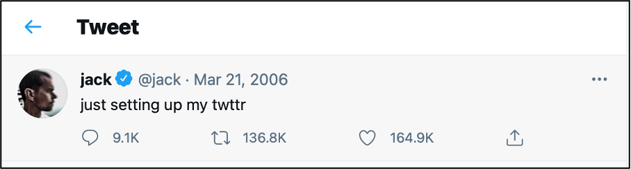
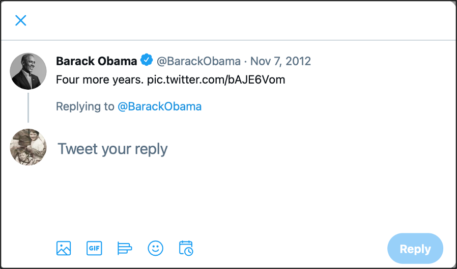

In this assignment, the various features/dimensions of the social medium Twitter are discussed: its history, how it is used, how it is analyzed and how it is preserved/archived.  (For instructions on how to work with social media data we refer to the module LARGE, as more time, effort and guidance is required)
Answer the questions below in your answer form.

<!-- more -->
<!-- briefing-student -->

### 7.a Twitter’s history and specific characteristics 
<!-- section-contents -->]

*How it was created*

Image Credit: An early sketch of the ideas that would become Twitter. Published on Jack Dorsey's Flickr account on 24 March 2006 and available at: https://flickr.com/photos/jackdorsey/182613360/.

Read [this interview in the Los Angeles Times of February 18 2009 with Jack Dorsey](https://latimesblogs.latimes.com/technology/2009/02/twitter-creator.html), one of the founders of Twitter 
- What was the inspiration for Dorsey to create Twitter?
- How did he design a prototype for the application?
- Which feature of Instant Messaging was emulated for Twitter?

{:.w-100}
{:style="height:100px"}
| |

*How it is defined*

Go to the [Twitter beginner’s guide](https://help.twitter.com/en/new-user-faq) to answer this question:
- What is a tweet?
- What is the length (the number of characters) of a tweet at present?
- Has it always been this length?
- Why is the number of characters of a tweet limited?
- How does the limitation of characters relate to the specificity of Twitter?

{:.w-100}
{:style="height:100px"}
| |

*How it changed over time*

Image credit: Current Twitter logo respecting the Brand Guidelines. Taken from https://about.twitter.com/en/who-we-are/brand-toolkit. 

Now go to the present Twitter homepage: http://www.twitter.com 

*Note 1: in this section, we will use the Internet Archive’s Wayback Machine. For a guideline on how to use this resource see: [handout Wayback machine](https://ranke2.uni.lu/assets/pdf/wayback-machine-interface.pdf)  

*Note 2: Those who already have a Twitter account need to first log out, to be able to complete this assignment!

- What does the text say on the homepage?

{:.w-100}
{:style="height:100px"}
| |

- Open these three hyperlinks to the Internet Archive and copy the texts on the homepage of Twitter into the table of your answer form 

- https://web.archive.org/web/20060930214639/https://twitter.com/
- https://web.archive.org/web/20090413225407/http://twitter.com/
- https://web.archive.org/web/20150319071319/https://twitter.com/

|Text Home page Twitter  |  2006 | 2009 | 2015 |
|   |   |   |
|   |   |   |
|   |   |   |

- What can you say about the changes? 

{:.w-100}
{:style="height:100px"}
| |

*How you can interact with others*

Image credit: Screenshot of selecting "reply" to an already posted Tweet taken on a desktop computer on 14 April 2021.

Go to this [New York Times article by Mike Isaac](https://www.nytimes.com/2017/09/26/technology/twitter-280-characters.html?smid=url-share) 
- In what ways can you respond to a Tweet?
- Can you “like” a Tweet? Why would you?
- Can you mention a user in a Tweet? Why?

{:.w-100}
{:style="height:100px"}
| |

*How a Tweet is archived*

Image credit: Jack Dorsey (@jack) - https://twitter.com/jack/status/20 

- Go to https://twitter.com/jack/status/20

This is the first tweet ever published, by the creator of Twitter Jack Dorsey. Unlike other old tweets, it is still on-line and readable on Twitter.
- Compare the tweet as it is on Twitter to these two snapshots of the same tweet: 
- https://web.archive.org/web/20081103142857/https://twitter.com/jack/status/20
- https://web.archive.org/web/20150321230408/https://twitter.com/jack/status/20

Those two snapshots are versions of the tweets archived by the Wayback Machine on archive.org. Jack Dorsey’s tweet such as it is displayed on Twitter is not an archive. But by comparing them, you can guess some difficulties that archivists meet to archive social media. Can you, by comparing those three versions of the same tweet, list some of those difficulties?

{:.w-100}
{:style="height:100px"}
| |

<!-- section -->

<!-- briefing-teacher -->

