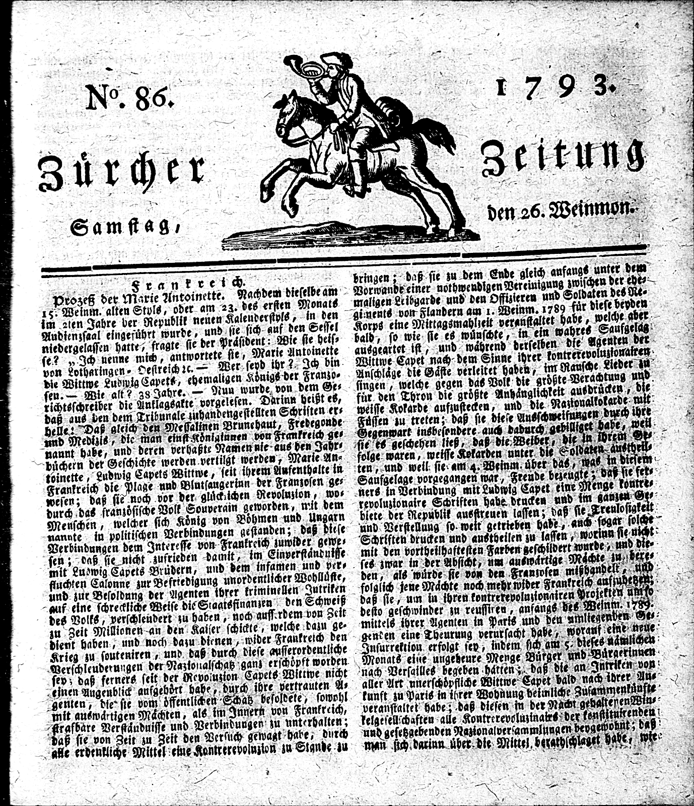
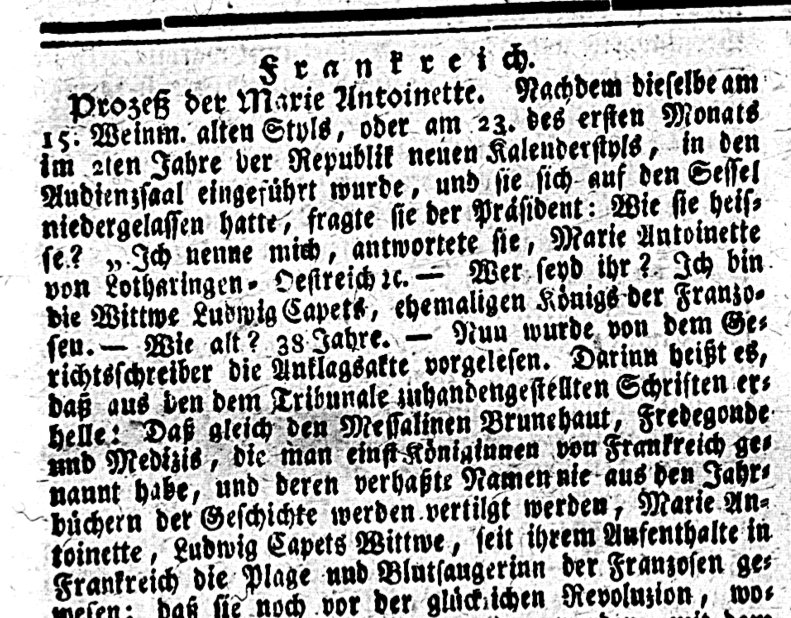

---
layout: assignment
unit: webarchives
lang: en
title: "The web and its technologies"
cover:
tags:
  - web technology
  - web history
  - information and power
requirements: Fast WIFI connection, computer or laptop, application on laptop or computer to view video,
learning outcomes:
  - Understand the basics of how the web developed and how it works 
order: 1
---
These assignments will briefly explore the history of the web and the technological developments that make it work. They will then dive into the differences between the web and the internet, before discussing the physical infrastructure that allows the world to be globally connected.

<!-- more -->

<!-- briefing-student -->

### Instructions
<!-- section-contents -->

<!-- section -->

### 1.a The history of the web and the technology behind it | ? Min
<!-- section-contents -->

In the clip above, engineer Lars Wieneke explains how over time web technologies increasingly broadened the range and scale of data that could be shared and shown through the web. To illustrate these changes he elaborates on the two websites about the interview collection of the psychologist David Boder, the topic of another lesson on Ranke2, that were developed in 2000 and 2009.
Understanding the changes brought about by software such as Flash Player and languages such as XML (Extensible Markup Language) and PHP (Hypertext Preprocessor) is crucial in being able to apply source criticism to a website. However, as historians we should first place the topic into its historical context: how did websites evolve in the first place and what technologies were needed to make them work? 

-	For a brief overview of the history of the web and the technologies involved, read Sections 1, 2, 3 and 6 of “How the World Wide Web (WWW) works” by Chris Woodford (2006/2020) (https://www.explainthatstuff.com/howthewebworks.html)
-	For an insight into the role of one of the game changers in the history of the web, computer scientist Tim Berners-Lee, read this article by the World Wide Web Foundation: “History of the Web” (https://webfoundation.org/about/vision/history-of-the-web/) 
-	For an insight into the differences between Web 1.0, Web 2.0 and Web 3.0, read this concise history of web technologies: https://thebytestory.com/2018/11/09/a-short-history-on-web-technologies/

Now that you have some more information about the development of the web and about Tim Berners-Lee, answer the following questions:
-	Why was Tim Berners-Lee’s innovation fundamental for the development of the web? 
-	What is the difference between HTTP and HTML?
-	What is a URI/URL?
-	What is the difference between a web server and a web browser?
-	What is the main difference between Web 1.0, Web 2.0 and Web 3.0 technologies? 

<!-- section -->

### 1.b The difference between the web and the internet
<!-- section-contents -->

Most people use the terms “web” and “internet” interchangeably as they are very closely linked to each other, even though they are, in fact, two different things. In order to help you understand the crucial differences between the two, watch these two informative and humorous videos: 
-	“What is the world wide web? – Twila Camp” from TED-Ed (2014) (https://www.youtube.com/watch?v=J8hzJxb0rpc) (3.50 mins)
-	“The Web Is Not The Net” by VSauce (2014) (https://youtu.be/scWj1BMRHUA?t=34), only from 00:34 to 05:04

After watching the video explanations from Twila Camp and VSauce, note the xxx most important differences between the internet and the web. 

|enter your answers in the answer form|
|------------------------|
|------------------------|

To connect the differences between the web and the internet to your own use of both, here is a list of common things that people do with their smartphones or computers for which they need the internet and/or the web. Put a cross in the right column(s).  

|     | Common things done on a computer/smartphone | Uses the internet but not the web | 	Uses both the internet and the web | 
| --- | -------------- | ----------------- | ------------ | --------------------------- | -----------------|
| Searching for a picture on Google	|   |   |   |  
| Using Skype for a video call |   |   |   |  
| Checking email with an application |   |   |   |  
| Looking at your Facebook or Instagram feed on a web browser|   |   |   |  
| Sharing a file with someone via a peer-to-peer file network |   |   |   |  
| Downloading a file from a website |   |   |   |  
| Making a call via FaceTime |   |   |   |  

<!-- section -->

### 1.c Improvement of OCR quality
<!-- section-contents -->

This is the scanned image of the front page of the Neue Zürcher Zeitung (NZZ) published on 26.10.1793 in Zürich, Switzerland. It reports on the trial and execution of Louis XVI’s widow Marie Antoinette in October 1793.

The archives of the NZZ were entirely digitised for the first time in 2005, using the microfilms of newspapers to produce scans that were then OCRed. The result of this process proved to be imperfect, especially for earlier texts that were published in Gothic font.

As part of the impresso project, referred to in the clip of this lesson, Phillip Ströbel and Simon Clematide from the University of Zurich have experimented with software developed to recognise handwritten text to improve the quality of the OCR on Gothic fonts.

The two outputs of the OCR are shown below. Compare them and answer the questions.

|**A. First lines of the front page article of the 26.10.1793 issue of the NZZ**|

| **B. OCR output in 2005** |
| Prozeß der Marie Antoinette. Nachdem dieselbe am i g. Weinm. alten StvlS, oder am rz. des ersten Monat« im 2,en Jahre der Republik neuen KaleuderstplS, in den Audienzsaal eingesührt wurde, und sie sich auf den Sessel niedergelassen hatte- fragte sie der Präsident: Wie sie heisse? „ Ich nenne mich, antwortete sie, Marie Antoinette von Lotharingen. Oestreich re. — Wer seyd ihr ?. Ich bin dir Wittwr Ludwig Capet«, ehemaligen Königs der Frauzo« seu.— Wie alt? Z8 Jahre. — Nun wurde von demGe-richtsschreiber die Auklagsakte vorgelesen. Darin» heißt e«,daß aus den dem Tribunale rnhandengestellten Schriften erhellet 'Daß gleich den Messalinen Brunehaut, Fredegoude»nd Medizi«, die man einstKöniainnea von Frankreich genannt habe, und deren verhaßte Namennie au« de» Jahrbüchern der Geschichte werden vertilgt werde» , Marie Antoinette , Ludwig Capets Wittwr, feit ihrem Aufenthalte inFrankreich die Plage und Blotfaugeriun der Franzosen gewesen; daß sie" noch vor der glücklichen Revoluzion |
| **improved OCR output in 2019** |
| Prozeß der Marie Antoinette. Nachdem dieselbe am 15. Weinm. alten Styls, oder am 23. des ersten Monats im 2ten Jahre der Republik neuen Kalenderstyls, in den Audienzsaal eingeführt wurde, und sie sich auf den Sessel niedergelassen hatte, fragte sie der Präsident: Wie sie heisse? „ Ich nenne mich, antwortete sie, Marie Antoinette von Lotharingen- Oestreich ic. — Wer seyd ihr ?. Ich bin die Wittwe Ludwig Capets, ehemaligen Königs der Franzosen.— Wie alt? 38 Jahre. — Nun wurde von dem Gerichtsschreiber die Anklagsakte vorgelesen. Darinn heißt es, daß aus en dem Tribunale zuhandengestellten Schriften erhelle: Daß gleich den Messalinen Brunehaut, Fredegonde und Medizis, die man einst Königinnen von Frankreich genaunt habe, und deren verhaßte Namen nie aus den Jahrbüchern der Geschichte werden vertilgt werden, Marie Antoinette, Ludwig Capets Wittwe, seit ihrem Aufenthalte in Frankreich die Plage und Blutsaugerinn der Franzosen gewesen; daß sie noch vor der glückichen Revoluzion |

- How was the word “Wittwe” recognised in 2005 and 2019?
- What differences do you notice in the recognition of numbers between the 2005 and 2019 outputs?

Now have a look at the manual transcription of the same passage, and compare this to how the numbers were recognised in the 2005 and 2019 outputs.

| **A. Manual Transcription** |
| Prozeß der Marie Antoinette. Nachdem dieselbe am 15. Weinm. alten Styls, oder am 23. des ersten Monats im 2tem Jahre der Republik neuen Kalenderstyls, in den Audienzsaal eingeführt wurde, und sie sich auf dem Sessel niederlassen hatte, fragte sie der Präsident: Wie sie heisse? “Ich nenne mich, antwortete Sie, Marie Antoinette von Lotharingen-Oestreich - Wer seyd ihr? Ich bin die Wittwe Ludwig Capets, ehemaligen König der Franzosen. - Wie alt? 38 Jahre. - Nun wurde von dem Gerichtsschreiber die Anklagsakte vorgelesen. Darinn heißt es daß aus den dem Tribunale zuhandengestellten Schriften erhelle: Daß gleich den Messalinen Brunehaus, Fredegonde und Medizis, die man einst Königin von Frankreich genannt habe, und deren verhaßte Namen nie aus den Jahrbüchern der Geschichte werden vertilgt werden, Marie Antoinette, Ludwig Capets Wittwe, seit ihrem Aufenthalte in Frankreich die Plage und Blutsaugerinn der Franzosen gewesen: daß sie noch der glücklichen Revoluzion, |

- Would you have been able to find this article on the basis of the first OCR if you had searched with the following keywords? (explain why for each case)
“Marie Antoinette”
“Revolution”

<!-- section -->

### Reading/viewing suggestions
<!-- section-contents -->

- For a technical and historical overview and information about some applications of optical character recognition (OCR), take a look at the [Wikipedia article on this topic](https://en.wikipedia.org/wiki/Optical_character_recognition){:target="_blank"}

- To understand how optical character recognition (OCR) identifies characters and words(known as pattern recognition), watch  the [explanation by Aryaman Sharda](https://www.youtube.com/watch?v=cAkklvGE5io){:target="_blank"}

- For a more detailed explanation of each step of the optical character recognition (OCR) process, watch the [interview with Professor Steve Simske by Computerphile](https://www.youtube.com/watch?v=ZNrteLp_SvY){:target="_blank"}

- [Prof. Steve Simske explains the principle of binarisation](https://youtu.be/ZNrteLp_SvY?t=149){:target="_blank"}

- Here is information about [the single connected component (or one letter)](https://youtu.be/ZNrteLp_SvY?t=235){:target="_blank"} followed by information on the recognition of the types of letters used in a given text, or [the classification of the fonts](https://youtu.be/ZNrteLp_SvY?t=446){:target="_blank"}

<!-- briefing-teacher --
