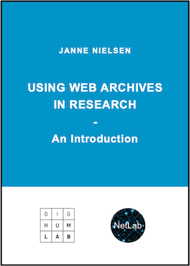

Wie im Clip von Lars Wieneke beschrieben, veränderten sich die Websites von David Boder aus den Jahren 2000 und 2009 im Laufe der Zeit, als neue Technologien verfügbar wurden. Die ältere Version aus dem Jahr 2000 existiert nicht mehr im „Live“-Web, dennoch ist dank des archivierten Webs ein Vergleich zwischen der im Jahr 2000 veröffentlichten Version und der neuen Version von 2009 möglich. Bei dieser Aufgabe werden Sie die Grundlagen des archivierten Webs kennenlernen und sich mit einer der beliebtesten und nützlichsten Ressourcen für den Zugriff auf archivierte Webseiten vertraut machen – der Wayback Machine des Internet Archive. Gleichzeitig werden Sie die Herausforderungen und Grenzen der Web-Archivierung aus der Sicht eines Historikers kennenlernen.

Sehen Sie sich eine archivierte Version der allerersten Website an, die 1991 von Tim Berners-Lee erstellt und vom CERN in der Schweiz archiviert wurde:

[card](project-internet)

<!-- more -->

<!-- briefing-student -->

### 2.a Der Unterschied zwischen Live-Web und archiviertem Web
<!-- section-contents -->

Das Live-Web besteht aus allen Webseiten, auf die Sie in diesem Moment zugreifen können. Wenn Sie die URL https://www.google.com, die Startseite der derzeit beliebtesten Suchmaschine weltweit, in Ihren Web-Browser eingeben, öffnet sich die Seite und Sie können sofort auf die Suchmaschine zugreifen. Dies unterscheidet sich vom **archivierten Web**, das aus Webseiten besteht, auf die Sie nicht mehr zugreifen können, deren Informationen aber in Form früherer Versionen dieser Webseiten gespeichert wurden. Ohne das **archivierte Web** bestünde die Gefahr, dass Web-Inhalte völlig aus der zugänglichen Geschichtsschreibung verschwinden. Deshalb ist es für den Beruf des Historikers von entscheidender Bedeutung zu wissen, wie man mit Web-Archiven umgeht und wie man sicherstellt, dass die Web-Inhalte bewahrt bleiben.

Um einen ersten Einblick in Web-Archive zu erhalten, lesen Sie sich zunächst bitte drei Abschnitte aus der Veröffentlichung 
 [*Using Web Archives in Research: An Introduction* by Janne Nielsen (Aarhus: NetLab, 2016)](https://dighumlab.org/wp-content/uploads/2017/06/Nielsen_Using_Web_Archives_in_Research.pdf)

{:target="_blank"}

Answer the questions below:
1.	Abschnitt 1 „Introduction“ (S. 6–10)
2.  Abschnitt 2.1 „Main Types of Web Archiving“ (S. 11–12)
3.  Abschnitt 2.5 „Characteristics of the Archived Material“ (S. 23)

Beantworten Sie anschließend die nachstehenden Fragen:
- Warum wurden Web-Archive geschaffen und wie können sie genutzt werden?
- Wie lautet die Definition der Web-Archivierung des International Internet Preservation Consortium (IIPC)?
- Wie oft hat sich eine typische Webseite zwischen 2000 und 2010 geändert oder ist verschwunden? Inwiefern unterscheidet sich dies vom derzeitigen Änderungstempo?
- Wodurch unterscheidet sich die Web-Archivierung von der traditionellen Archivierung?
- Welche Herausforderungen sind mit der Web-Archivierung verbunden?
- Stellen Sie sich selbst in einer künftigen beruflichen Position vor (nicht unbedingt als Historiker): In welcher Situation wären Kenntnisse über die Web-Archivierung nützlich?

Nachdem Sie nun wissen, was Web-Archive sind, lesen Sie sich bitte das folgende hypothetische Beispiel durch und beantworten Sie dann die unten stehenden Fragen.

*Hypothetisches Beispiel:* Sie besuchen am Dienstag, den 11. Februar, eine kleine Website mit Informationen über die letzten Spiele einer lokalen Fußballmannschaft. Sie suchen nach dem Ergebnis des letzten Spiels und finden die gesuchten Informationen. Am Mittwoch, den 12. Februar, versuchen Sie erneut, die Website aufzurufen, um Ihrem Freund das Ergebnis zu zeigen, aber die Website sieht völlig anders aus. Schließlich finden Sie die Informationen, aber sie befinden sich auf einer anderen Seite der Website, und Sie brauchen länger als zuvor, um sie zu finden. Wenn Sie die Website am Freitag, den 14. Februar, ein drittes Mal besuchen, um die Ergebnisse des letzten Spiels zu überprüfen, stellen Sie fest, dass Sie die Website überhaupt nicht mehr aufrufen können, egal wie oft Sie die Seite aktualisieren oder welchen Browser Sie verwenden.

- Was sind mögliche Gründe dafür, dass die Website zwischen den verschiedenen Tagen, an denen Sie sie aufgerufen haben, geändert wurde und dann verschwunden ist?
- Wie könnten Sie die Informationen wiederfinden, die Sie gesehen haben, auf die Sie aber nicht mehr zugreifen können?

<!-- section -->

### 2.b Die Wayback Machine kennenlernen
<!-- section-contents -->

In dieser Unteraufgabe werden Sie die Geschichte des Internet Archive erkunden, einer gemeinnützigen Organisation, die 1996 vom Computeringenieur Brewster Kahle mit dem Ziel gegründet wurde, eine vollständige digitale Aufzeichnung der Vergangenheit zu erstellen. Sie wird im Clip zu dieser Lektion in Minute 3:05 von Ingenieur Lars Wieneke erwähnt, als er erklärt, wie sich „Schnappschüsse“ der Website von David Boder aus dem Jahr 2000 abrufen lassen.

Wenn man bedenkt, dass [im Jahr 2020 jede Minute ca. 360–380 neue Websites erstellt wurden](https://siteefy.com/how-many-websites-are-there/), hat sich Kahle eine fast unmögliche Aufgabe gestellt. Die Wayback Machine des Internet Archive sammelt Material aus dem Web, indem Roboter, sogenannte [Webcrawler](https://de.wikipedia.org/wiki/Webcrawler), so programmiert werden, dass sie zu bestimmten Zeitpunkten „Schnappschüsse“ von bestimmten Webseiten machen. Diese Schnappschüsse sind keine Screenshots, sondern ermöglichen es den Nutzern, auf interaktive Weise durch das Web der Vergangenheit zu navigieren, obwohl sie nur eine Auswahl von Webseiten und nicht die gesamte Geschichte einer Website wiedergeben. Das Ausmaß dessen, was dennoch archiviert wird, ist nach wie vor beeindruckend, insbesondere wenn man bedenkt, dass sich [die Anzahl der Seiten im Live-Web auf etwa 6 Milliarden beläuft](https://www.worldwidewebsize.com/), während die Internet Archive Wayback Machine Zugang zu mehr als 480 Milliarden archivierten Webseiten bietet (Stand November 2020). Außerdem ist das Internet Archive nicht mehr die einzige Organisation, die das Web archiviert. Institutionen auf nationaler Ebene (meist Nationalbibliotheken) in Irland, Dänemark, Luxemburg, der Schweiz, Portugal, Frankreich und Großbritannien, um nur einige zu nennen, kuratieren Web-Inhalte, die für ihr jeweiliges Land relevant sind. Die beiden letztgenannten Länder haben Web-Archive sogar als eine Kategorie in ihre Pflichtexemplare aufgenommen, was bedeutet, dass Webseiten, die sich auf ihre Bürger oder ihren Staat beziehen, als Veröffentlichungen betrachtet werden, die für die Aufzeichnungen der offiziellen Geschichte dieser Länder von entscheidender Bedeutung sind.

{:target="_blank"}
Bildnachweis: J.Blyberg

Um sich mit der Internet Archive Wayback Machine vertraut zu machen, besuchen Sie bitte [diese kurze Webseite](https://help.archive.org/help/wayback-machine-general-information/) und beantworten Sie im Anschluss die folgenden Fragen:
- Was ist der Unterschied zwischen Internet Archive und Wayback Machine?
- Was ist das Kriterium für die Erfassung von Webseiten über die Wayback Machine?
- Wer kann auf die in der Wayback Machine verfügbaren Informationen zugreifen?
- Mit welchen Organisationen arbeitet das IA zusammen und was ist der Grund für diese Zusammenarbeit?

  

Nutzen Sie als nächstes diesen PDF-„Spickzettel“ [cit](wayback-machine-interface), auf dem die Benutzeroberfläche der Wayback Machine am Beispiel der Google-Startseite erklärt wird, um die folgenden Fragen zu beantworten:
- Suchen Sie in der Wayback Machine mithilfe von Schlüsselbegriffen oder einer bestimmten URL nach Schnappschüssen (gespeicherten Versionen) einer Webseite.
- Was sind die Vor- und Nachteile des Systems der Wayback Machine, mit dem frühere, gespeicherte Versionen einer Webseite gefunden werden können?
- Wo kann man herausfinden, wie oft eine bestimmte URL in der Wayback Machine gespeichert wurde?
- Welche Informationen erhalten Sie allein anhand seiner URL über einen Schnappschuss?
- Wie lässt sich herausfinden, welche Organisation oder welcher Roboter den Crawl für den von Ihnen betrachteten Snapshot durchgeführt hat?

<!-- section -->

### 2.c Die ursprünglichen Ambitionen der Wayback Machine im Vergleich zu späteren Überlegungen
<!-- section-contents -->
Als Historiker ist es wichtig, eine Ressource wie die Wayback Machine in einen historischen Kontext zu stellen. Idealismus und der Glaube an die demokratisierende Kraft der Technologie standen bei der Schaffung dieser Ressource im Mittelpunkt. Um dies besser zu verstehen, sehen Sie sich bitte diese drei Videoausschnitte aus einer Präsentation von Brewster Kahle für die Long Now Foundation aus dem Jahr 2011 an.

[card](access-knowledge)

1.  Die grundlegenden Ziele des Internet Archive (9:36–12:30)
2.  Wie die Wayback Machine das Internet bewahrt (40:55–44:39)
3.  Die vom Internet Archive und der Wayback Machine verfolgten Bewahrungsstrategien (45:41–50:20)

Beantworten Sie nun die folgenden Fragen (ggf. mit zusätzlicher Internetrecherche):
- Was war die Bibliothek von Alexandria?
- Wie würden Sie Brewster Kahles Idee des „universellen Zugangs zu allem Wissen“ mit eigenen Worten beschreiben?
- Welchen Wert hat die Bewahrung von Webseiten für einen Historiker?
- Warum gibt es mehrere physische Standorte für die digitalen Archive des Internet Archive?

 

Vergleichen Sie nun das Gesagte in den von Ihnen angesehenen Passagen aus dem Jahr 2011 mit dem Diskurs, den Brewster Kahle in seiner Eröffnungsrede auf der Charleston Conference im Jahr 2019 führte (von 3:29 bis 12:22).

[card](trust-truth)

Und beantworten Sie die folgenden Fragen:
- Welcher Unterschied fällt Ihnen auf?
- Warum könnte sich Ihrer Meinung nach die Idee von Kahle geändert haben?
- Glauben Sie, dass diese Zusammenarbeit mit Wikipedia eine gute Richtung für das Internet Archive und die Wayback Machine ist? Warum bzw. warum nicht?

<!-- section -->

### 2.d Erfahren Sie, wie die Webseiten von Google und YouTube bewahrt wurden
<!-- section-contents -->
Abschließend ist es an der Zeit, dass Sie das Web-Archivierungsprogramm des Internet Archive, die Wayback Machine, selbst erkunden. Bedenken Sie bei dieser Aufgabe, dass die WM aufgrund der riesigen Datenmenge in ihren Archiven ([über 25 Petabyte oder 25 Millionen Gigabyte im Jahr 2018](https://thehustle.co/inside-wayback-machine-internet-archive)) manchmal etwas länger zum Laden braucht als vielleicht gewohnte Webseiten. Mitunter müssen Sie eine Seite ein- oder zweimal aktualisieren, damit sie richtig geladen wird.

Rufen Sie zunächst die Wayback Machine [https://web.archive.org/](https://web.archive.org/) auf und suchen Sie nach der Startseite von Google, indem Sie die URL `https://www.google.com/` in das Suchfeld eingeben. 

google
{:target="_blank"}

Schauen Sie sich die Notiz unter der roten Schaltfläche `Calendar` an. Wie viele Aufnahmen der Webseite unter dieser URL wurden gemacht und in welchem Zeitraum?

 

Scrollen Sie nun unterhalb der Information, die Ihnen die Anzahl der URL-Aufnahmen anzeigt, aber oberhalb der Kalenderansicht der letzten 12 Monate durch das chronologische Balkendiagramm, das alle Jahre anzeigt, in denen die URL gespeichert wurde. Klicken Sie auf das allererste Jahr, in dem diese Webseite gespeichert wurde, und suchen Sie dann nach dem Monat, in dem der allererste Schnappschuss gemacht wurde. Klicken Sie schließlich auf diesen ersten Schnappschuss von Google, der von der Wayback Machine gespeichert wurde.

Lassen Sie sich einige der klassischen Fragen durch den Kopf gehen, die Sie bei jeder historischen Quelle stellen würden: Wer hat das erstellt? Wann wurde es erstellt? Warum wurde es erstellt? Wie wurde es erstellt? Welcher Zweck wurde mit der Erstellung verfolgt? Wie wurde es seinerzeit verwendet? Wie sah es damals im Vergleich zu anderen ähnlichen Quellen aus?
- Beantworten Sie mithilfe des PDF-„Spickzettels“ [cit](wayback-machine-interface) die Fragen zur klassischen historischen Quellenkritik und fügen Sie ggf. weitere hinzu.

1. Wer hat das erstellt?
2. Wann wurde es erstellt?
3. Warum wurde es erstellt?
4. Wie wurde es erstellt?
5. Welcher Zweck wurde mit der Erstellung verfolgt?
6. Wie wurde es seinerzeit verwendet?
7. Wie sah es damals im Vergleich zu anderen ähnlichen Quellen aus?

 

Gehen Sie dann zum nächsten gespeicherten Datum der Google-Startseite (dieses sollte im nächsten Monat liegen) und klicken Sie auf den Schnappschuss. Untersuchen Sie den Inhalt der Seite und ihre Hyperlinks, um den Zweck des Unternehmens und den Grund für die Wahl des Namens „Google“ herauszufinden.

1. Zweck
2. Warum der Name „Google“?

Gehen Sie nun zurück zur aktuellen Startseite der Wayback Machine [https://web.archive.org/](https://web.archive.org/) und suchen Sie unter der URL `https://www.youtube.com` nach der Startseite von YouTube. Suchen Sie den ersten gespeicherten Schnappschuss, der in der Wayback Machine verfügbar ist, und klicken Sie auf den Link.
- Was sind Ihre ersten Eindrücke von der damaligen YouTube-Startseite?

 

Machen Sie einen Screenshot von diesem ersten Schnappschuss. Versuchen Sie dann, auf die Registerkarten in diesem Schnappschuss zu klicken („Favorites“, „Messages“, „Videos“).
- Was geschieht? Was bedeutet das für die Nutzung der Wayback Machine als Ressource für die Archivierung von Webseiten?

 

Gehen Sie nun zurück zu Ihrer Kalenderansicht mit allen Zeitpunkten, an denen YouTube von der Wayback Machine gespeichert wurde. Klicken Sie auf einen Schnappschuss, der 10 Jahre nach dem ersten Schnappschuss erstellt wurde, und machen Sie auch davon einen Screenshot. Nutzen Sie die folgende Tabelle und nennen Sie die Unterschiede zwischen den YouTube-Funktionen im Jahr 2005 und 2015. Hinweis: Wenn Sie die nachstehenden Informationen nicht in den Schnappschüssen finden, stellen Sie weitere Nachforschungen an und vermerken Sie, welche andere(n) Quelle(n) Sie zurate gezogen haben, um die Informationen zu finden.

| | 2005 | 2015 |
| Ihr screenshot |
| Design |
| Navigationslinks oben |
| Informationen über das Unternehmen |
| Auf was kann zugegriffen werden? |
| Hinweise zum Datenschutz |
| Hinweise zum Urheberrecht |

Wäre die Wayback Machine für Sie nützlich, um herauszufinden, ob sich der Charakter des hochgeladenen Materials auf YouTube zwischen 2005 und 2010 verändert hat?
<!-- section -->

### Empfehlungen Lektüre/Video
<!-- section-contents -->

-	Nielsen, Janne. *Using Web Archives in Research: An Introduction*. Aarhus: NetLab, 2016. [E-book](https://dighumlab.org/wp-content/uploads/2017/06/Nielsen_Using_Web_Archives_in_Research.pdf)
-	Brügger, Niels, and Ralph Schroeder, eds. *The Web as History: Using Web Archives to Understand the Past and the Present.* London: UCL Press, 2017. [E-book](https://discovery.ucl.ac.uk/id/eprint/1542998/1/The-Web-as-History.pdf)
-	Huss, Nick. “How Many Websites Are There Around The World?” Sateefy. ? Sateefy. Zuletzt geändert am 27. November 2022. [Website](https://siteefy.com/how-many-websites-are-there/)
-	Musiani, Francesca, Camille Paloque-Bergès, Valérie Schafer, and Benjamin G. Thierry. *Qu’est-ce qu’une archive du Web?* et al. Marseille: OpenEdition, 2019. [E-book](https://books.openedition.org/oep/8713)

<!-- briefing-teacher -->
