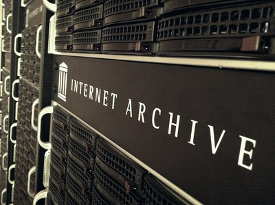
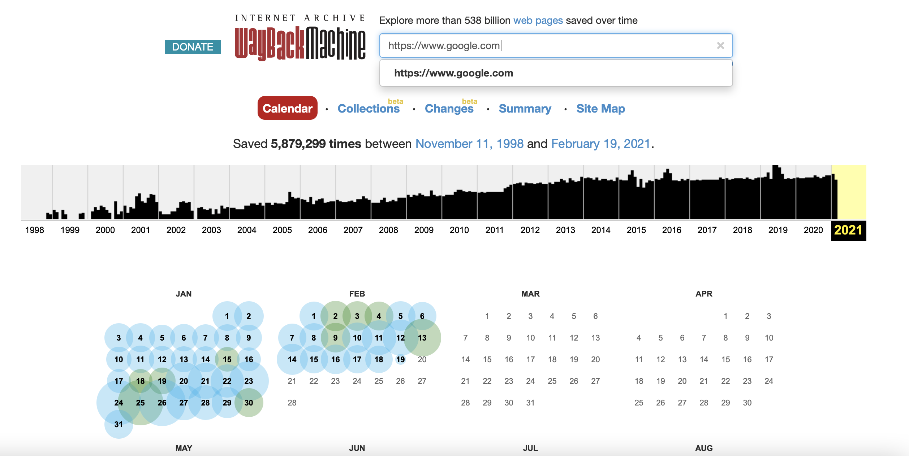

As described in the clip by Lars Wieneke, the David Boder websites from 2000 and 2009 changed over time as new technology became available. The older version from 2000 no longer exists on the “live” web, but a comparison between the version published in 2000 and the new 2009 version is possible thanks to the archived web. In this assignment, you will learn about the basics of the archived web and become familiar with one of the most popular and useful resources to access archived web pages – the Internet Archive’s Wayback Machine. At the same time you will learn about the challenges and limits of web archiving from a historian’s point of view.

See an archived version of the very first website ever created in 1991 by Tim Berners-Lee and archived by CERN in Switzerland:

[card](project-internet)

<!-- more -->

<!-- briefing-student -->

### 2.a The difference between the live web and the archived web| ? Min
<!-- section-contents -->

The live web consists of any web page or website that you can access *at this very moment*. If you type the URL https://www.google.com, the home page of what is currently the world’s most popular search engine, into your web browser, the page will appear and you can immediately access the search engine. This is different from the **archived web**, which consists of web pages or websites that you can no longer access but whose information has been saved in the form of past versions of that web page or website. Without the **archived web** we would run the risk of web content disappearing from the accessible historical record entirely. This is why knowing both how to deal with web archives and how to ensure that web content is preserved are key for the historian’s profession.

For a basic understanding of what web archives are, start by reading three sections from the publication
 *Using Web Archives in Research: An Introduction* by Janne Nielsen (Aarhus: NetLab, 2016) (http://www.netlab.dk/wp-content/uploads/2016/10/Nielsen_Using_Web_Archives_in_Research.pdf)

{:target="_blank"}

Answer the questions below:
1.	Section 1 “Introduction” (pp. 6-10)
2.	Section 2.1 “Main Types of Web Archiving” (pp. 11-12)
3.	Section 2.5 “Characteristics of the Archived Material” (p. 23)

Questions:
-	Why were web archives created and how can they be used?
-	What is the definition of web archiving as given by the International Internet Preservation Consortium (IIPC)?
-	How often did a typical web page last before it changed or disappeared from the year 2000 to 2010? How does this differ from the pace of changes at present?
-	In what ways is web archiving different from traditional archiving?
-	What are some challenges associated with web archiving?
-	Imagine yourself in a future professional role (not necessarily a historian): in what kind of situation would knowledge about web archiving be useful?

| use the answer form to write down the answers |

Now that you have some knowledge about what web archives are, read the hypothetical example below and answer the questions that follow.

Hypothetical example: You visit a small website that has information about the recent matches of a local football team on Tuesday 11 February. You look for the score of the most recent match and are able to find the information you are searching for. On Wednesday 12 February, you try to access the website again to show the score to your friend, but the website looks completely different. You eventually find the information but it’s on a different page on the website and it takes you more time to find it than before. When you visit the website a third time on Friday 14 February to check the results of the latest match, you discover that you can’t access the website at all, no matter how many times you refresh the page or which browser you use.

-	What are some potential reasons why the website changed and then disappeared between the different dates that you accessed it?
-	How might you go about trying to recover the information you remember seeing but can no longer access?

| use the answer form to write down the answers |

<!-- section -->

### 2.b Familiarising yourself with the Wayback Machine
<!-- section-contents -->

In this sub-assignment, you will explore the history of the Internet Archive, a non-profit organisation that was established by computer engineer Brewster Kahle in 1996 with the objective of creating a complete digital record of the past. It is mentioned in the clip for this lesson, at minute 3:05, by engineer Lars Wieneke, when he explains how it is possible to retrieve “snapshots” of the David Boder website from 2000.

Taking into consideration that approximately 360-380 new websites were created *every minute* in 2020 (source – https://siteefy.com/how-many-websites-are-there/), Kahle has set himself a nearly impossible task. The way in which the Internet Archive’s Wayback Machine collects material from the web is by programming robots called web crawlers (https://en.wikipedia.org/wiki/Web_crawler) in such a way that they take “snapshots” of certain web pages at specific points in time. These snapshots are not screenshots; they allow users to navigate the web of the past in an interactive manner, although they only yield a selection of web pages rather than the entire history of a website. The scale of what is nonetheless archived remains quite impressive, especially bearing in mind that the number of pages on the live web is currently around 6 billion (https://www.worldwidewebsize.com/), while the Internet Archive Wayback Machine provides access to more than 480 billion archived web pages (as of November 2020). Additionally, the Internet Archive is no longer the only organisation that archives the web. Institutions at the national level (mostly national libraries) in Ireland, Denmark, Luxembourg, Switzerland, Portugal, France and the United Kingdom, to name but a few, curate web content that is relevant for their country. The latter two countries have even included web archives as a category in their [legal deposits](https://en.wikipedia.org/wiki/Legal_deposit), meaning that web pages related to their citizens or state are considered as publications that are vital for records of the countries’ official history.

{:target="_blank"}
credits J.Blyberg

To familiarise yourself with the Internet Archive Wayback Machine, read this short web page (https://help.archive.org/hc/en-us/articles/360004716091-Wayback-Machine-General-Information) and answer the following questions:
-	What is the difference between the Internet Archive and the Wayback Machine?
-	What is the criterion for web pages to be collected by the Wayback Machine?
-	Who can access the information available on the Wayback Machine?
-	What organisations does the IA work with and what is the rationale behind the collaboration?

{:style="width: 100%"}
| |
| |
| |
| |

Next, use this PDF “cheat sheet” [cit](wayback-machine-interface) that gives an explanation of the Wayback Machine's interface with Google’s home page as an example, to answer the following questions:
-	Do you search for snapshots (saved versions) of a web page in the Wayback Machine with key terms or with a specific URL?
-	What are the benefits and disadvantages of the Wayback Machine’s system of finding past saved versions of a web page?
-	Where can you find the number of times a particular URL has been saved in the Wayback Machine?
-	What information can you tell about a snapshot just by looking at its URL?
-	How can you find out which organisation or robot performed the crawl for the snapshot you are looking at?

{:style="width: 100%"}
| |
| |
| |
| |
| |

<!-- section -->

### 2.c The original ambitions of the Wayback Machine compared to later thoughts
<!-- section-contents -->
As a historian it is vital to place a resource such as the Wayback Machine in a historical context. Idealism and belief in the democratising power of technology lie at the heart of the creation of this resource. To understand this more clearly, watch these three video segments from a 2011 presentation by Brewster Kahle to the Long Now Foundation.

[card](access-knowledge)

1.	The objectives of the Internet Archive as a foundation (9:36 - 12:30)
2.	How the Wayback Machine is used to preserve the web (40:55 - 44:39)
3.	The preservation strategies pursued by the Internet Archive and the Wayback Machine (45:41 - 50:20)

Now answer the following questions (with additional web research if needed):
-	What was the Library of Alexandria?
-	How would you describe Brewster Kahle’s idea of “universal access to all knowledge” in your own words?
-	What is the value of preserving web pages for a historian?
-	Why are there multiple physical locations for the digital archives of the Internet Archive?

| use the answer form to write down the answers |

Now compare the narrative in the passages you watched from 2011 with the discourse adopted in the opening keynote talk by Brewster Kahle in 2019 at the Charleston Conference (from 3:29 to 12:22).

[card](trust-truth)

and answer the following questions:
-	What strikes you as different?
-	In your opinion, why might Kahle’s idea have changed?
-	Do you think this collaboration with Wikipedia is a good direction for the Internet Archive and the Wayback Machine to go in? Why or why not?

| use the answer form to write down your answers |

<!-- section -->

### 2.d Explore how the web pages of Google and YouTube have been preserved
<!-- section-contents -->
Finally, it is time for you to explore the Internet Archive’s web archiving tool, the Wayback Machine, yourself. While doing this assignment, keep in mind that owing to the sheer amount of data saved in its archives (over 25 petabytes or 25 million gigabytes as of 2018 – source https://thehustle.co/inside-wayback-machine-internet-archive), the WM can sometimes take a little longer to load than the web pages you might be used to. Sometimes you need to refresh a page once or twice to get it to load properly.

First, go to the Wayback Machine (https://web.archive.org/) and search for Google’s home page by entering the URL https://www.google.com/ in the search box. The query should look like this: https://web.archive.org/web/*/https://www.google.com/

google
{:target="_blank"}

Have a look at the note under the red button marked “Calendar”. How many captures of the web page at this URL have been made and over what period?

| use the answer form to write down the answers |

Now, below the information that gives you the number of captures of the URL that have been made but above the calendar view of the past 12 months, scroll through the chronological bar graph showing all the years the URL has been saved. Find and click on the very first year that this web page was saved and then search for the month in which the very first snapshot was made. Finally, click on that first snapshot of Google saved by the Wayback Machine.

Think about some of the classic questions that you would ask of any historical source: Who created this? When did they create it? Why did they create it? How did they create it? What was their purpose in creating it? How was it used at the time? How did it look at the time compared to other similar sources?
-	Using the PDF “cheat sheet” as a guide, answer the classic historical source criticism questions above and feel free to add any others you can think of.

| Who created this? |
| When did they create it?|
| Why did they create it? |
| How did they create it? |
| What was their purpose in creating it? |
| How was it used at the time? |
| How did it look at the time compared to other similar sources? |

| use the answer form to write down the answers |

Next, go to the next saved date of the Google home page (it should be in the following month) and click on the snapshot. Explore the content of the page and its hyperlinks to find out the purpose of the company and the reason they choose the name “Google”.

| Purpose |
| Why the name “Google”? |

Now go back to the current home page of the Wayback Machine (https://web.archive.org/) and search for YouTube’s home page using the URL https://www.youtube.com. Find the first saved snapshot available on the Wayback Machine, and click on the link.
-	What are your first impressions of YouTube’s then home page?

| use the answer form to write down the answers |

Take a screenshot of this first snapshot. Then try to click on the tabs in this snapshot (“favorites”, “messages”, “videos”).
-	What happens? What does this mean for using the Wayback Machine as a resource for archiving web pages?

| use the answer form to write down the answers |

Now, go back to your calendar view of all the times that YouTube has been saved by the Wayback Machine. Click on a snapshot from 10 years after the first snapshot was made and take a screenshot of the snapshot. Complete the table below indicating differences between the features of YouTube in 2005 and 2015. Note: if you don’t find the information below in the snapshots, conduct additional research and note which other source(s) you consulted to find the information.

| | 2005 | 2015 |
| Your screenshot |
| Design |
| Navigation links at the top |
| Information about the company |
| What can be accessed |
| Notes about privacy |
| Notes about copyright |

Would the Wayback Machine be useful to you if you wanted to know whether the character of the uploaded material on YouTube has changed between 2005 and 2010?

| use the answer form to complete the table and write down your answers |
<!-- section -->

### Reading/viewing suggestions
<!-- section-contents -->

-	Nielsen, Janne. *Using Web Archives in Research: An Introduction*. Aarhus: NetLab, 2016. [E-book](http://www.netlab.dk/wp-content/uploads/2016/10/Nielsen_Using_Web_Archives_in_Research.pdf)
-	Brügger, Niels, and Ralph Schroeder, eds. *The Web as History: Using Web Archives to Understand the Past and the Present.* London: UCL Press, 2017. [E-book](https://discovery.ucl.ac.uk/id/eprint/1542998/1/The-Web-as-History.pdf)
-	Huss, Nick. “How Many Websites Are There Around The World?” Sateefy. Last modified November 27, 2022. [Website](https://siteefy.com/how-many-websites-are-there/)
-	Musiani, Francesca, Camille Paloque-Bergès, Valérie Schafer, and Benjamin G. Thierry. *Qu’est-ce qu’une archive du Web?* et al. Marseille: OpenEdition, 2019. [E-book](https://books.openedition.org/oep/8713)

<!-- briefing-teacher -->
